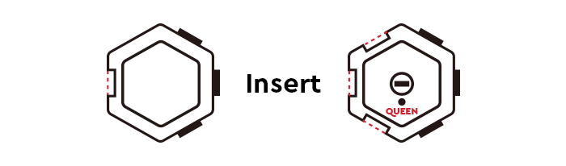

### How to Connect the Blocks Correctly? 

1. Follow the steps shown in the GIF to correctly connect the blocks.

2. Insert the convex of green block into the concave of blue block

3. With both blocks facing up, make sure the green block is on the right of the blue block.

