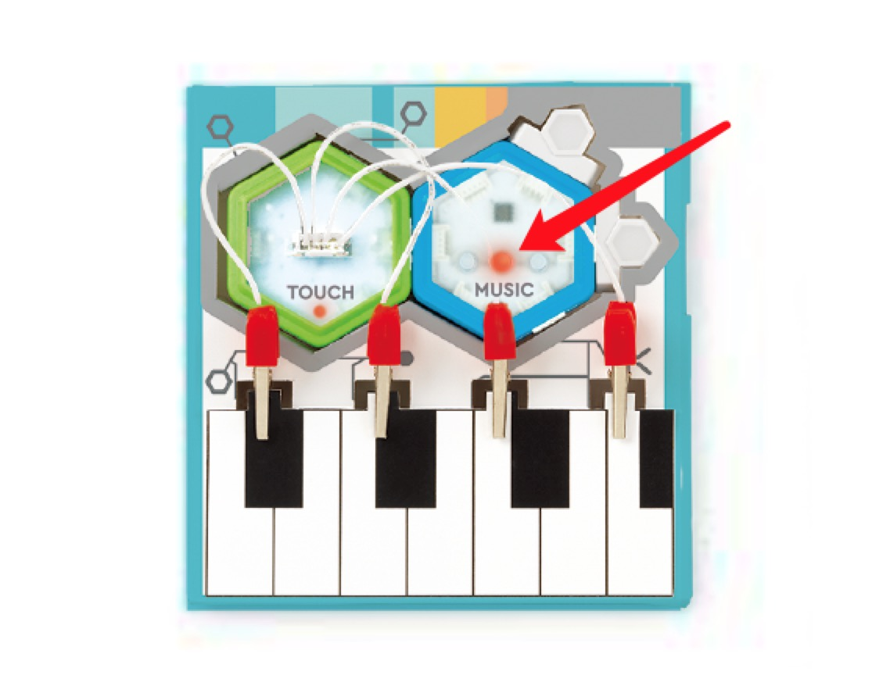

### Fruit kit - The Guitar Plays Notes Instead of Music
- Reset power and press Music block's middle button until the light turns yellow. Now the MUSIC block is in "CLASSIC SONG" mode, and you will be able to hear music from the guitar.

