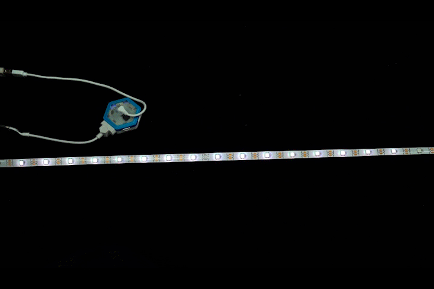
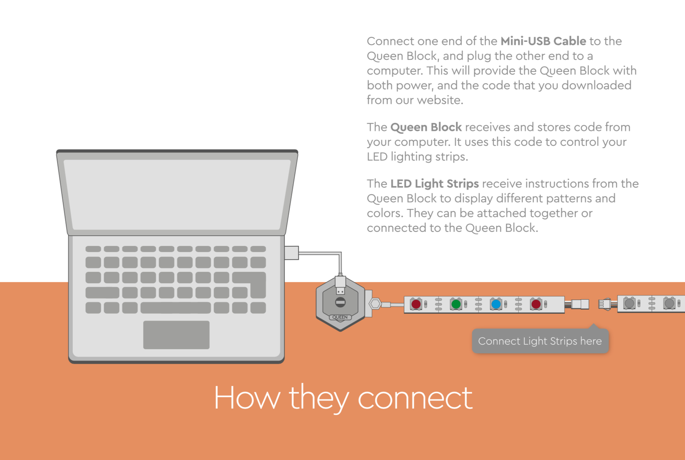
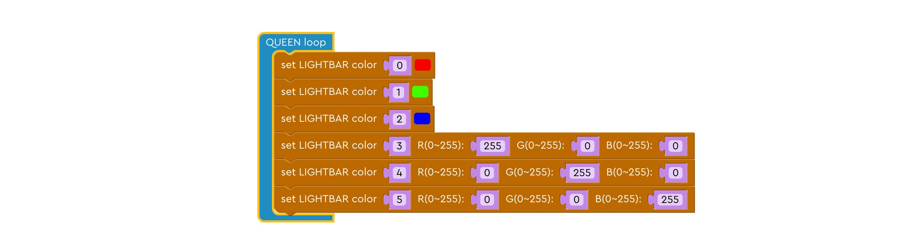
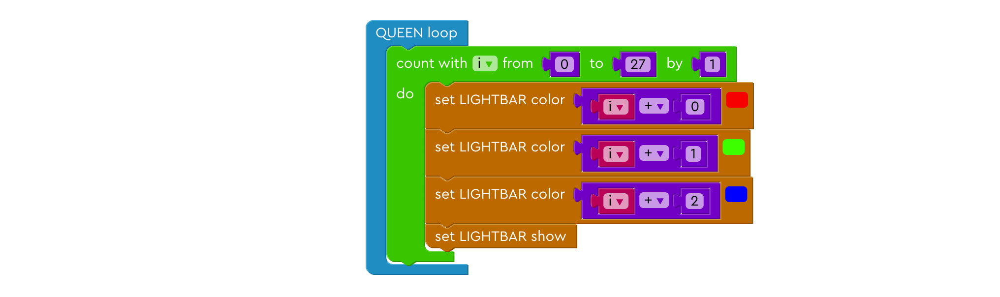
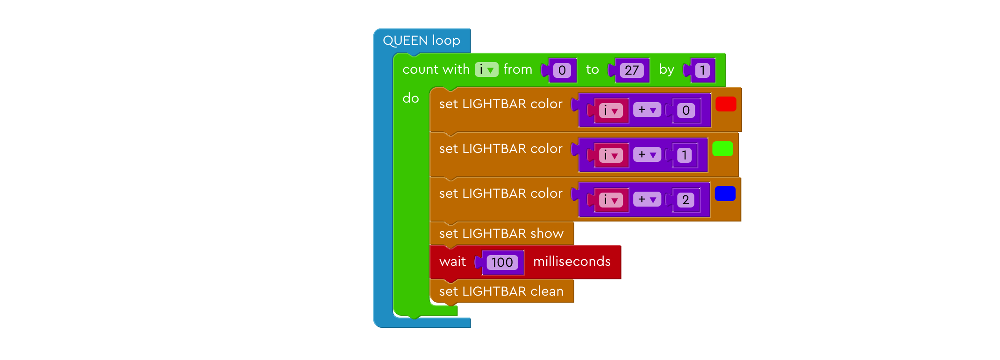
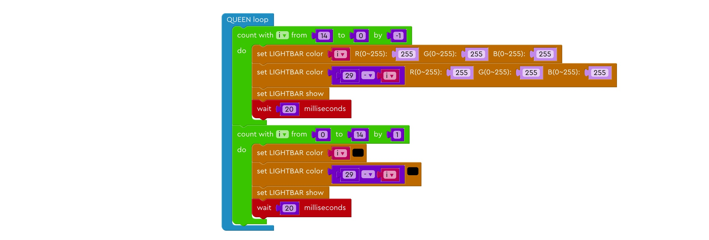
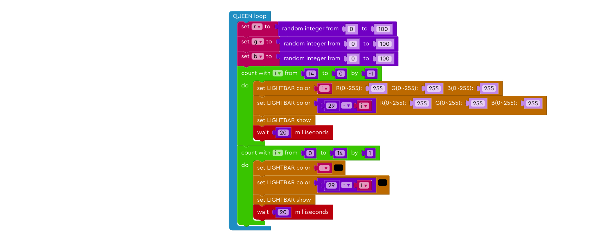
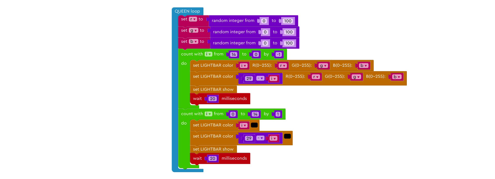

# Learning to Customize Your LED Lights!

Do you remember seeing all the cool light effects on the streets downtown? Those effects may look intimidating, but when it comes down to coding, they are actually quite simple. To get you started, let's start with these lessons down here.

---

## Getting Started!

Before we get started on coding, it is important to make sure that we have everything connected.

### Step 1

Make sure you have downloaded our software and driver on your computer. If you haven't, you can download them here: 
<a href="http://microcn.org/" target="_blank">JUKU Download</a>

After you have successfully downloaded JUKU app on your computer, it's time to assemble the kit! 

### Step 2

Plug the USB cord into QUEEN module, and connect it to your computer.

### Step 3

Connect the LED light strip to the **right** of the QUEEN module, as shown below.

**Now that we have assembled our kit, let's get to making the game!**

---

## Fun Code!

### Lesson 1. Meet the RGB

#### Step 1: How many shining lights?

Take a closer look a the light strip! The light strip is consisted of many small individual light bulbs. We can choose how many of these small lights we want to light. Here, we choose to light up the first 6 little light bulbs.

#### Step 2: Changing up the colors

We can also choose the color of each individual lights! We can do it in two ways. We can either choose given color in the program or tweak the RGB parameters to get the color we want. 

**Now you have mastered how to get the light strips to shine, let's do something cool!**

### Lesson 2. Flowing Water Lights

#### Step 1: How many shining lights?

As we did before, we want to control how many lights we want to light up. Here, we choose to light up 30 little light bulbs.

#### Step 2: Changing up the light bulbs

We want to change the color of the small lights one by one not all at once, so we can tell the program to count from 0 to 29, which is 30 numbers in total, the same number of the length of our light strip! Then we can tell different light to light up respective light bulb.

#### Step 3: Setting time intervals

Computers are not as smart as human sometimes. It doesn't know how fast they should count those numbers. So if we don't tell them to count slower, they are going to count it in the fastest speed possible. We want to slow it down a little bit so that we can see what's happening to the light strip, so we tell the computer to wait 100 milliseconds (0.1 second) before it count to the next number.

#### Step 4: Cleaning up!

After we finish counting from 0 to 29 for the first time, we want the entire light strip to dim so that when we move on to the second round, we can see what's happening. Think about it like this: after the first round, the first 30 light bulbs are lit. If we move on to the next round, these bulbs are still lit. Then in the next round, when we tell the light bulb to light up, it's already lit, which means it's not doing anything. So when we finish each round, we clean the entire light strip to get ready for the next round.

### Lesson 3. Shooting star lightbar

#### Step 1: How many shining lights?

As we did before, we want to control how many lights we want to light up. Here, we choose to light up 28 little light bulbs.

#### Step 2: Step up our game!

In the previous lesson, we tell one light bulb with respective number to light up during each count. Here, we also want to light up the next two light bulbs. We can do this with a little help of math!

#### Step 3: Setting time intervals

As we did before, we want to slow the count down a little bit so that we can see what's happening to the light strip, so we tell the computer to wait 100 milliseconds (0.1 second) before it counts to the next number.

#### Step 4: Cleaning up!

Same with before, we need to clean the entire light strip to get ready for the next round.

### Lesson 4. Spring light

#### Step 1: Some reading perhaps...

As you can see, we already provided some code. They are similar to the code we put together before. See if you can understand them! If not, come back when you get the light strip running and compare the code with the result, see if you can understand now!

#### Step 2: Back to coding!

The color of the light is decided by three parts: red, green, and blue. Together, we call them RGB. Tweaking the amount of each one of them will give us different results. We don't want our light to be too boring and predictable, so we can assign red, green, and blue different number to get different combinations. 

#### Step 3: RGB RGB RGB!

Now that we set red, green, and blue to different numbers, we need to assign these numbers to a light bulb. Otherwise, they are just some random numbers without meaning. 

