# More Light Effects For You!

We created some more light effects for you to learn and use! Find the effects you want to use and download them to your LED Light Kit!

- [Colorful Ripple](#colorful-ripple)

- [Halo Rainbow](#halo-rainbow)

- [Light Stack](#light-stack)

- [Wind Fire Wheel](#wind-fire-wheel)

- [Circular Rainbow](#circular-rainbow)

- [Bouncing Particles](#bouncing-particles)

- [Moving Particles](#moving-particles)

---

## Colorful Ripple

(<a href="./sampleGames/colorfulRipple.xml" download>Click here to download</a>)

Curl up your LED light strip with the end away from the QUEEN module in the center. You will see color ripple from the center circle moving to the outer circle, then moving back to the center circle. 

### Code Expert
---

#### 1. annulus1

This function controls the five light bulbs farthest from QUEEN module. It lights them up to a random color. It then pauses for 50 milliseconds before moving on to the next part.

Click here to view source code

    int annulus1() {
        r = random(0, 256);
        g = random(0, 256);
        b = random(0, 256);
        for (i = 0; i <= 4; i++) {
            strip.setPixelColor((59 - i),strip.Color(r,g,b));
        }
        strip.show();
        delay(50);
    }

   

#### 2. annulus2

This function controls the next eight light bulbs. It lights them up to a random color. It then pauses for 50 milliseconds before moving on to the next part.

Click here to view source code

    int annulus2() {
        r = random(0, 256);
        g = random(0, 256);
        b = random(0, 256);
        for (i = 0; i <= 7; i++) {
            strip.setPixelColor((54 - i),strip.Color(r,g,b));
        }
        strip.show();
        delay(50);
    }

   

#### 3. annulus3

This function controls the next ten light bulbs. It lights them up to a random color. It then pauses for 50 milliseconds before moving on to the next part.

Click here to view source code

    int annulus3() {
        r = random(0, 256);
        g = random(0, 256);
        b = random(0, 256);
        for (i = 0; i <= 9; i++) {
            strip.setPixelColor((46 - i),strip.Color(r,g,b));
        }
            strip.show();
            delay(50);
    }

   

#### 4. annulus4

This function controls the next twelve light bulbs. It lights them up to a random color. It then pauses for 50 milliseconds before moving on to the next part.

Click here to view source code

    int annulus4() {
        r = random(0, 256);
        g = random(0, 256);
        b = random(0, 256);
        for (i = 0; i <= 11; i++) {
            strip.setPixelColor((36 - i),strip.Color(r,g,b));
        }
        strip.show();
        delay(50);
}

   

#### 5. annulus5

This function controls the next fourteen light bulbs. It lights them up to a random color. It then pauses for 50 milliseconds before moving on to the next part.

Click here to view source code

    int annulus5() {
        r = random(0, 256);
        g = random(0, 256);
        b = random(0, 256);
        for (i = 0; i <= 13; i++) {
            strip.setPixelColor((24 - i),strip.Color(r,g,b));
        }
        strip.show();
        delay(50);
    }

   

#### 6. annulus6

This function controls the next twelve light bulbs. It lights them up to a random color. It then pauses for 50 milliseconds before moving on to the next part.

Click here to view source code

    int annulus6() {
        r = random(0, 256);
        g = random(0, 256);
        b = random(0, 256);
        for (i = 0; i <= 11; i++) {
            strip.setPixelColor((11 - i),strip.Color(r,g,b));
        }
        strip.show();
        delay(50);
    }

   

#### 7. annulnusClean1

This function controls the five light bulbs farthest from QUEEN module. It turns them off since the color black means no light from the light bulbs. It then pauses for 50 milliseconds before moving on to the next part.

Click here to view source code

    int annulusClean1() {
        for (i = 0; i <= 4; i++) {
            strip.setPixelColor((59 - i),strip.Color(0,0,0));
        }
        strip.show();
        delay(50);
    }

   

#### 8. annulnusClean2

This function controls the next eight light bulbs. It turns them off since the color black means no light from the light bulbs. It then pauses for 50 milliseconds before moving on to the next part.

Click here to view source code

    int annulusClean2() {
        for (i = 0; i <= 7; i++) {
            strip.setPixelColor((54 - i),strip.Color(0,0,0));
        }
        strip.show();
        delay(50);
    }

   

#### 9. annulnusClean3

This function controls the next ten light bulbs. It turns them off since the color black means no light from the light bulbs. It then pauses for 50 milliseconds before moving on to the next part.

Click here to view source code

    int annulusClean3() {
        for (i = 0; i <= 9; i++) {
            strip.setPixelColor((46 - i),strip.Color(0,0,0));
        }
        strip.show();
        delay(50);
    }

   

#### 10. annulnusClean4

This function controls the next twelve light bulbs. It turns them off since the color black means no light from the light bulbs. It then pauses for 50 milliseconds before moving on to the next part.

Click here to view source code

    int annulusClean4() {
        for (i = 0; i <= 11; i++) {
            strip.setPixelColor((36 - i),strip.Color(0,0,0));
        }
        strip.show();
        delay(50);
    }

   

#### 11. annulnusClean5

This function controls the next fourteen light bulbs. It turns them off since the color black means no light from the light bulbs. It then pauses for 50 milliseconds before moving on to the next part.

Click here to view source code

    int annulusClean5() {
        for (i = 0; i <= 13; i++) {
            strip.setPixelColor((24 - i),strip.Color(0,0,0));
        }
        strip.show();
        delay(50);
    }

   

#### 12. annulnusClean6

This function controls the next twelve light bulbs. It turns them off since the color black means no light from the light bulbs. It then pauses for 50 milliseconds before moving on to the next part.

Click here to view source code

    int annulusClean6() {
        for (i = 0; i <= 11; i++) {
            strip.setPixelColor((11 - i),strip.Color(0,0,0));
        }
        strip.show();
        delay(50);
    }

   

#### 13. QUEEN loop

This function turns the light bulb from end to start in an timely order. After all light bulbs have been turned on, it pauses for 50 milliseconds, and turns them off from start to end.

Click here to view source code

    void loop() {
        annulus1();
        annulus2();
        annulus3();
        annulus4();
        annulus5();
        annulus6();
        delay(50);
        annulusClean6();
        annulusClean5();
        annulusClean4();
        annulusClean3();
        annulusClean2();
        annulusClean1();
    }

   

---
## Halo Rainbow

(<a href="./sampleGames/haloRainbow.xml" download>Click here to download</a>)

Curl up your LED light strip with the end away from the QUEEN module in the center. You will see a rainbow of many colors flickering on the light strip.

### Code Expert
---

#### 1. turnAround1

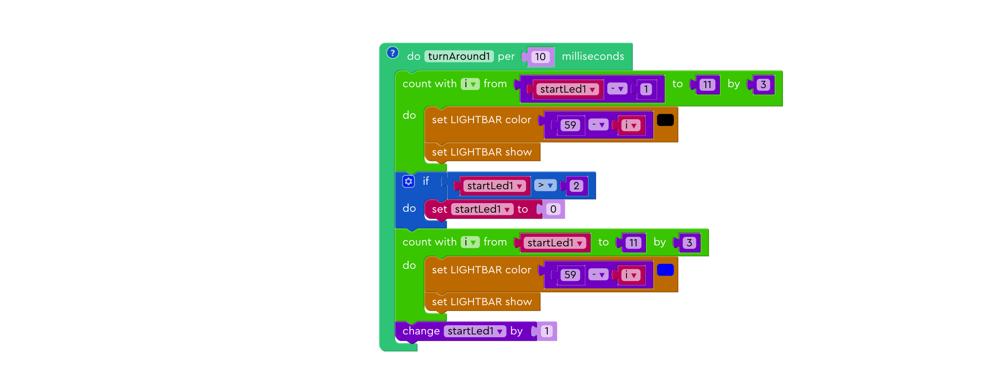

This function controls the twelve light bulbs farthest from QUEEN module. It divides these twelve light bulbs into four consecutive groups of three light bulbs. It first turns on the first light bulbs of these three groups to color blue. Then it turns them off, and move on to the second light bulbs of these three groups, and then the third. Finally, it returns to the first light bulbs and repeat process.

Click here to view source code

    void turnAround1() {
        int i_start2 = startLed1 - 1;
        int i_inc3 = 3;
        if (i_start2 > 11) {
            i_inc3 = -i_inc3;
        }
        for (i = i_start2;
             i_inc3 >= 0 ? i <= 11 : i >= 11;
             i += i_inc3) {
            strip.setPixelColor((59 - i), strip.Color(0, 0, 0));
            strip.show();
        }
        if (startLed1 > 2) {
            startLed1 = 0;
        }
        int i_inc4 = 3;
        if (startLed1 > 11) {
            i_inc4 = -i_inc4;
        }
        for (i = startLed1;
            i_inc4 >= 0 ? i <= 11 : i >= 11;
            i += i_inc4) {
           strip.setPixelColor((59 - i), strip.Color(0, 0, 255));
            strip.show();
        }
        startLed1 += 1;
    }

   

#### 2. turnAround2

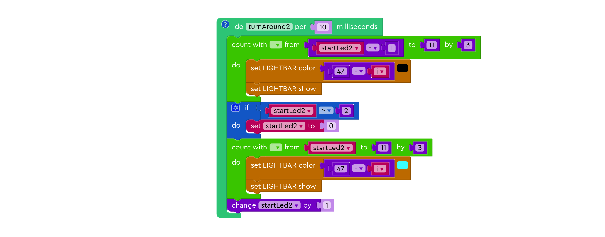

This function controls the next twelve light bulbs. It divides these twelve light bulbs into four consecutive groups of three light bulbs. It first turns on the first light bulbs of these three groups to color teal. Then it turns them off, and move on to the second light bulbs of these three groups, and then the third. Finally, it returns to the first light bulbs and repeat process.

Click here to view source code

    void turnAround2() {                                            
        int i_start4 = startLed2 - 1;                               
        int i_inc7 = 3;                                             
        if (i_start4 > 11) {                                        
            i_inc7 = -i_inc7;                                       
        }                                                           
        for (i = i_start4;                                          
             i_inc7 >= 0 ? i <= 11 : i >= 11;                       
             i += i_inc7) {                                         
            strip.setPixelColor((47 - i), strip.Color(0, 0, 0));    
            strip.show();                                           
        }                                                           
        if (startLed2 > 2) {                                        
            startLed2 = 0;                                          
        }                                                           
        int i_inc8 = 3;                                             
        if (startLed2 > 11) {                                       
            i_inc8 = -i_inc8;                                       
        }                                                           
        for (i = startLed2;                                         
             i_inc8 >= 0 ? i <= 11 : i >= 11;                       
             i += i_inc8) {                                         
            strip.setPixelColor((47 - i), strip.Color(0, 255, 255));
            strip.show();                                           
        }                                                           
        startLed2 += 1;                                             
    }                                                               

   

#### 3. turnAround3

This function controls the next twelve light bulbs. It divides these twelve light bulbs into four consecutive groups of three light bulbs. It first turns on the first light bulbs of these three groups to color green. Then it turns them off, and move on to the second light bulbs of these three groups, and then the third. Finally, it returns to the first light bulbs and repeat process.

Click here to view source code

    void turnAround3() {
        int i_start = startLed3 - 1;
        int i_inc = 3;
        if (i_start > 11) {
            i_inc = -i_inc;
        }
        for (i = i_start;
             i_inc >= 0 ? i <= 11 : i >= 11;
             i += i_inc) {
            strip.setPixelColor((35 - i), strip.Color(0, 0, 0));
            strip.show();
        }
        if (startLed3 > 2) {
            startLed3 = 0;
        }
        int i_inc2 = 3;
        if (startLed3 > 11) {
            i_inc2 = -i_inc2;
        }
        for (i = startLed3;
             i_inc2 >= 0 ? i <= 11 : i >= 11;
             i += i_inc2) {
            strip.setPixelColor((35 - i), strip.Color(0, 255, 0));
            strip.show();
        }
        startLed3 += 1;
    }

   

#### 4. turnAround4

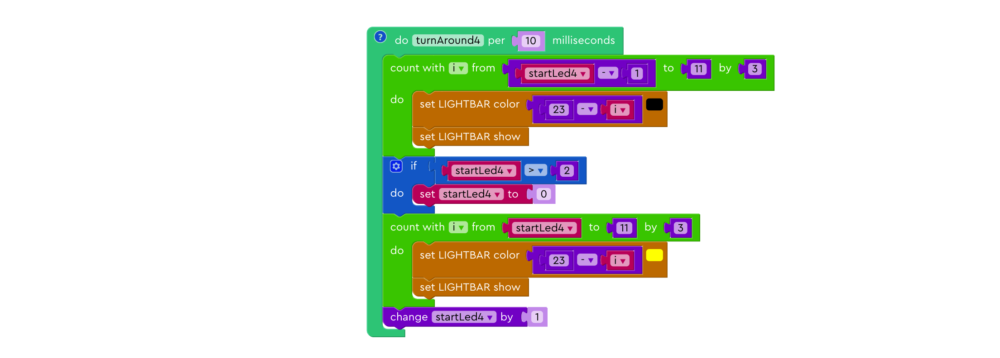

This function controls the next twelve light bulbs. It divides these twelve light bulbs into four consecutive groups of three light bulbs. It first turns on the first light bulbs of these three groups to color yellow. Then it turns them off, and move on to the second light bulbs of these three groups, and then the third. Finally, it returns to the first light bulbs and repeat process.

Click here to view source code

    void turnAround4() {
        int i_start3 = startLed4 - 1;
        int i_inc5 = 3;
        if (i_start3 > 11) {
            i_inc5 = -i_inc5;
        }
        for (i = i_start3;
             i_inc5 >= 0 ? i <= 11 : i >= 11;
             i += i_inc5) {
            strip.setPixelColor((23 - i), strip.Color(0, 0, 0));
            strip.show();
        }
        if (startLed4 > 2) {
            startLed4 = 0;
        }
        int i_inc6 = 3;
        if (startLed4 > 11) {
            i_inc6 = -i_inc6;
        }
        for (i = startLed4;
             i_inc6 >= 0 ? i <= 11 : i >= 11;
             i += i_inc6) {
            strip.setPixelColor((23 - i), strip.Color(255, 255, 0));
            strip.show();
        }
        startLed4 += 1;
    }

   

#### 5. turnAround5

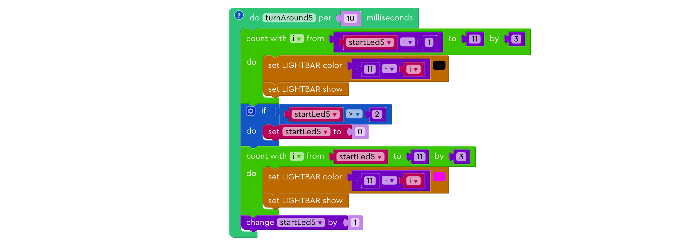

This function controls the next twelve light bulbs. It divides these twelve light bulbs into four consecutive groups of three light bulbs. It first turns on the first light bulbs of these three groups to color pink. Then it turns them off, and move on to the second light bulbs of these three groups, and then the third. Finally, it returns to the first light bulbs and repeat process.

Click here to view source code

    void turnAround5() {
        int i_start5 = startLed5 - 1;
        int i_inc9 = 3;
        if (i_start5 > 11) {
            i_inc9 = -i_inc9;
        }
        for (i = i_start5;
             i_inc9 >= 0 ? i <= 11 : i >= 11;
             i += i_inc9) {
            strip.setPixelColor((11 - i), strip.Color(0, 0, 0));
            strip.show();
        }
        if (startLed5 > 2) {
            startLed5 = 0;
        }
        int i_inc10 = 3;
        if (startLed5 > 11) {
            i_inc10 = -i_inc10;
        }
        for (i = startLed5;
             i_inc10 >= 0 ? i <= 11 : i >= 11;
             i += i_inc10) {
            strip.setPixelColor((11 - i), strip.Color(255, 0, 255));
            strip.show();
        }
        startLed5 += 1;
    }

   

#### 6. QUEEN setup

This function sets the length of the light strip to be lit and initializes five variables to 1.

Click here to view source code

    void loop() {
        turnAround3Timer.update();
        turnAround1Timer.update();
        turnAround4Timer.update();
        turnAround2Timer.update();
        turnAround5Timer.update();
    }

   

---
## Light Stack
(<a href="./sampleGames/lightStack.xml" download>Click here to download</a>)

Put your LED light strip down in a long line. You'll see that the light strip will light up form the end closest to the QUEEN module. Then it moves towards the end and as soon as it hits the end, the light bulb at the end that remained dim is lit. This process repeats itself until all the light bulbs become permanently lit. 

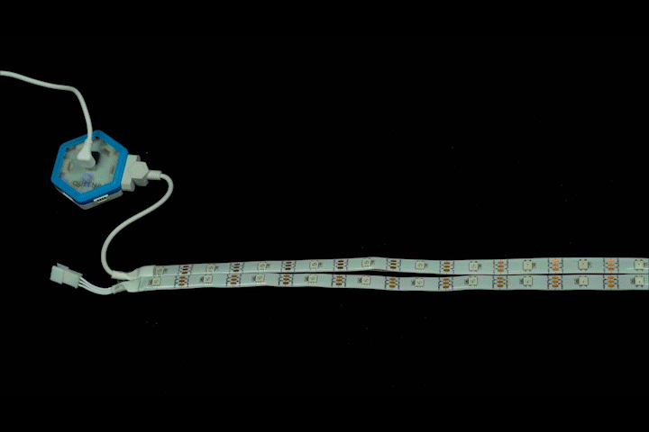

### Code Expert
---

#### 1. QUEEN loop

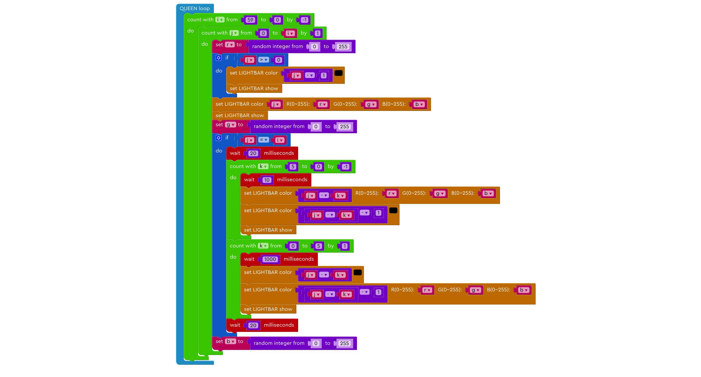

This function keeps count of three variables, i, j, and k. Variable "i" is responsible for looping through the entire loop from the end to the start of the light strip. The "j" variable is responsible for looping in the reverse direction from the start of the light strip to the light bulb variable "i" is currently pointing to. Variable "k" is responsible for lighting the end of the light bulb as well as the next five light bulb just to create some more flash.

Click here to view source code

    void loop() {
      for (i = 59; i >= 0; i--) {
        int j_inc = 1;
        if (0 > i) {
          j_inc = -j_inc;
        }
        for (j = 0;
             j_inc >= 0 ? j <= i : j >= i;
             j += j_inc) {
          r = random(0, 256);
          if (j > 0) {
            strip.setPixelColor((j - 1),strip.Color(0,0,0));
            strip.show();
          }
          strip.setPixelColor(j,strip.Color(r,g,b));
          strip.show();
          g = random(0, 256);
          if (j == i) {
            delay(20);
            for (k = 0; k <= 5; k++) {
              delay(10);
              strip.setPixelColor((j - k),strip.Color(0,0,0));
              strip.setPixelColor(((j - k) - 1),strip.Color(r,g,b));
              strip.show();
            }
            delay(20);
            for (k = 5; k >= 0; k--) {
              delay(10);
              strip.setPixelColor((j - k),strip.Color(r,g,b));
              strip.setPixelColor(((j - k) - 1),strip.Color(0,0,0));
              strip.show();
            }
          }
          b = random(0, 256);
        }
      }

    }

   

## Wind Fire Wheel

(<a href="./sampleGames/windFireWheel.xml" download>Click here to download</a>)

Curl up your LED light strip with the end away from the QUEEN module in the center. You'll see three effects cycling through to mimic a wind fire wheel.

### Code Expert
---

#### 1. marquee

This function lights up the light bulbs in random colors one by one from the start to the end. Only one light bulb is lit each time.

Click here to view source code

    int marquee() {
      for (i = 0; i <= 59; i++) {
        r = random(0, 256);
        g = random(0, 256);
        b = random(0, 256);
        strip.setPixelColor(i,strip.Color(r,g,b));
        strip.show();
        delay(time);
        for(int i=0;i<PIXEL_COUNT;i++){
          strip.setPixelColor(i,strip.Color(0,0,0));
        }
        strip.show();
      }
    }

   

#### 2. setPixelHeight

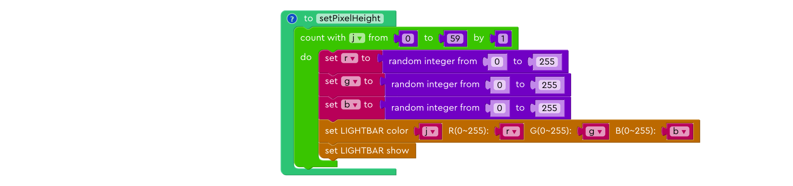

This function changes the color the light bulbs to random colors one by one from the start to the end. The difference between this function and the function **marquee** is that the entire light strip is lit while the color changes.

Click here to view source code

    int setPixelHeight() {
      for (j = 0; j <= 59; j++) {
        r = random(0, 256);
        g = random(0, 256);
        b = random(0, 256);
        strip.setPixelColor(j,strip.Color(r,g,b));
        strip.show();
      }
    }

   

#### 3. QUEEN Loop

This function first goes through the **marquee** effect five times, each time faster than the last one. Next, it goes through the **setPixelHeight** effect twenty times. Last, it goes through **setPixelHeight** effect ten times, but wait for 100 milliseconds and clean the light strip fter each round of **setPixelHeight** is completed.

Click here to view source code

    void loop() {
      for (k = 0; k <= 4; k++) {
        time = (6 - k) * 5;
        marquee();
      }
      for (k = 0; k <= 19; k++) {
        setPixelHeight();
      }
      for (k = 0; k <= 9; k++) {
        setPixelHeight();
        delay(100);
        for(int i=0;i<PIXEL_COUNT;i++){
          strip.setPixelColor(i,strip.Color(0,0,0));
        }
        strip.show();
      }

   

## Circular Rainbow

(<a href="./sampleGames/circularRainbow.xml" download>Click here to download</a>)

Curl up your LED light strip with the end away from the QUEEN module in the center. You'll see a streak of rainbow crossing over the light strip, changing the color of the strip each time. 

> TODO: Add pic/gif here

### Code Expert
---

#### 1. QUEEN setup

This function sets the "waitTime" to "50" and the length of the light strip to "60". As you can see in the function "QUEEN loop", the variable "waitTime" is used to tell the program to wait 50 milliseconds before changing the color of the light strip. Otherwise, the program will execute the loop very fast and we won't be able to keep track of what's happening. To understand better, you can change "waitTime" to "0" or other integers greater than zero and re-upload the program. We set the "waitTime" variable inside QUEEN setup function because this variable is constant throughout the entire time this fucntion is run and does not need to be updated at any time.

Click here to view source code

    void setup() {
        startupMelody();
        strip.begin();
        strip.show();
        waitTime = 50;
    }

   

#### 2. QUEEN loop

To understand this function, let's break down this function to three parts - the outermost loop that counts "i" from 0 to 6 by 1, the middle if-else statements, and the innermost loops that count "j/k/m/n/p/q" form 0 to 59 by 1. Let's start from inside to outside.

The innermost loops are responsible for the rainbow crossing over the light strip once. As the variables change from 0 to 59, the color of seven of the light bulbs at corresponding positions change accordingly. If you take a closer look at each of the seven innermost loops, you can see that the color arrangements are different from one another. This is because we want to change the color of the entire strip each time the rainbow moves across the light strip, and the color at the end of the rainbow leaves a trail, causing the color change. So by changing the color arrangement, we change the color at the end of the rainbow, thus changing the color of the entire strip..

Now, let's talk about the middle statemetns and the outermost loops. Since we have seven color arrangements, we need to somehow rotate between these arrangements, sort of like forming a circle, a loop. The outermost loop does just that. It changes from 0 to 6, seven numbers in total. After it counts to 6, it comes back to the top and starts from 0 again. However, just counting is not enough. We need to tell the program what to do as it counts to each number, which color arrangement to execute. Thus, it is reasonable that we specify a unique color arrangement for every number, which is exactly the function of the middle if-else statements.

Click here to view source code

    void loop() {
        for (i = 0; i <= 6; i++) {
            if (i == 0) {
                for (j = 0; j <= 59; j++) {
                    strip.setPixelColor((j + 0), strip.Color(255, 153, 51));
                    strip.setPixelColor((j + 1), strip.Color(255, 255, 0));
                    strip.setPixelColor((j + 2), strip.Color(0, 255, 0));
                    strip.setPixelColor((j + 3), strip.Color(0, 255, 255));
                    strip.setPixelColor((j + 4), strip.Color(0, 0, 255));
                    strip.setPixelColor((j + 5), strip.Color(204, 0, 204));
                    strip.setPixelColor((j + 6), strip.Color(255, 0, 0));
                    strip.show();
                    delay(waitTime);
                }
            } else if (i == 1) {
                for (k = 0; k <= 59; k++) {
                    strip.setPixelColor((k + 0), strip.Color(255, 255, 0));
                    strip.setPixelColor((k + 1), strip.Color(0, 255, 0));
                    strip.setPixelColor((k + 2), strip.Color(0, 255, 255));
                    strip.setPixelColor((k + 3), strip.Color(0, 0, 255));
                    strip.setPixelColor((k + 4), strip.Color(204, 0, 204));
                    strip.setPixelColor((k + 5), strip.Color(255, 0, 0));
                    strip.setPixelColor((k + 6), strip.Color(255, 153, 51));
                    strip.show();
                    delay(waitTime);
                }
            } else if (i == 2) {
                for (m = 0; m <= 59; m++) {
                    strip.setPixelColor((m + 0), strip.Color(0, 255, 0));
                    strip.setPixelColor((m + 1), strip.Color(0, 255, 255));
                    strip.setPixelColor((m + 2), strip.Color(0, 0, 255));
                    strip.setPixelColor((m + 3), strip.Color(204, 0, 204));
                    strip.setPixelColor((m + 4), strip.Color(255, 0, 0));
                    strip.setPixelColor((m + 5), strip.Color(255, 153, 51));
                    strip.setPixelColor((m + 6), strip.Color(255, 255, 0));
                    strip.show();
                    delay(waitTime);
                }
            } else if (i == 3) {
                for (n = 0; n <= 59; n++) {
                    strip.setPixelColor((n + 0), strip.Color(0, 255, 255));
                    strip.setPixelColor((n + 1), strip.Color(0, 0, 255));
                    strip.setPixelColor((n + 2), strip.Color(204, 0, 204));
                    strip.setPixelColor((n + 3), strip.Color(255, 0, 0));
                    strip.setPixelColor((n + 4), strip.Color(255, 153, 51));
                    strip.setPixelColor((n + 5), strip.Color(255, 255, 0));
                    strip.setPixelColor((n + 6), strip.Color(0, 255, 0));
                    strip.show();
                    delay(waitTime);
                }
            } else if (i == 4) {
                for (o = 0; o <= 59; o++) {
                    strip.setPixelColor((o + 0), strip.Color(0, 0, 255));
                    strip.setPixelColor((o + 1), strip.Color(204, 0, 204));
                    strip.setPixelColor((o + 2), strip.Color(255, 0, 0));
                    strip.setPixelColor((o + 3), strip.Color(255, 153, 51));
                    strip.setPixelColor((o + 4), strip.Color(255, 255, 0));
                    strip.setPixelColor((o + 5), strip.Color(0, 255, 0));
                    strip.setPixelColor((o + 6), strip.Color(0, 255, 255));
                    strip.show();
                    delay(waitTime);
                }
            } else if (i == 5) {
                for (p = 0; p <= 59; p++) {
                    strip.setPixelColor((p + 0), strip.Color(204, 0, 204));
                    strip.setPixelColor((p + 1), strip.Color(255, 0, 0));
                    strip.setPixelColor((p + 2), strip.Color(255, 153, 51));
                    strip.setPixelColor((p + 3), strip.Color(255, 255, 0));
                    strip.setPixelColor((p + 4), strip.Color(0, 255, 0));
                    strip.setPixelColor((p + 5), strip.Color(0, 255, 255));
                    strip.setPixelColor((p + 6), strip.Color(0, 0, 255));
                    strip.show();
                    delay(waitTime);
                }
            } else if (i == 6) {
                for (q = 0; q <= 59; q++) {
                    strip.setPixelColor((q + 0), strip.Color(255, 0, 0));
                    strip.setPixelColor((q + 1), strip.Color(255, 153, 51));
                    strip.setPixelColor((q + 2), strip.Color(255, 255, 0));
                    strip.setPixelColor((q + 3), strip.Color(0, 255, 0));
                    strip.setPixelColor((q + 4), strip.Color(0, 255, 255));
                    strip.setPixelColor((q + 5), strip.Color(0, 0, 255));
                    strip.setPixelColor((q + 6), strip.Color(204, 0, 204));
                    strip.show();
                    delay(waitTime);
                }
            }
        }
    
    }

   

## Bouncing Particles

(<a href="./sampleGames/leftRight.xml" download>Click here to download</a>)

Put your LED light strip down in a long line. You'll see that five light particles will bounce between left and right.

> TODO: Add pic/gif here

### Code Expert
---

#### 1. QUEEN loop

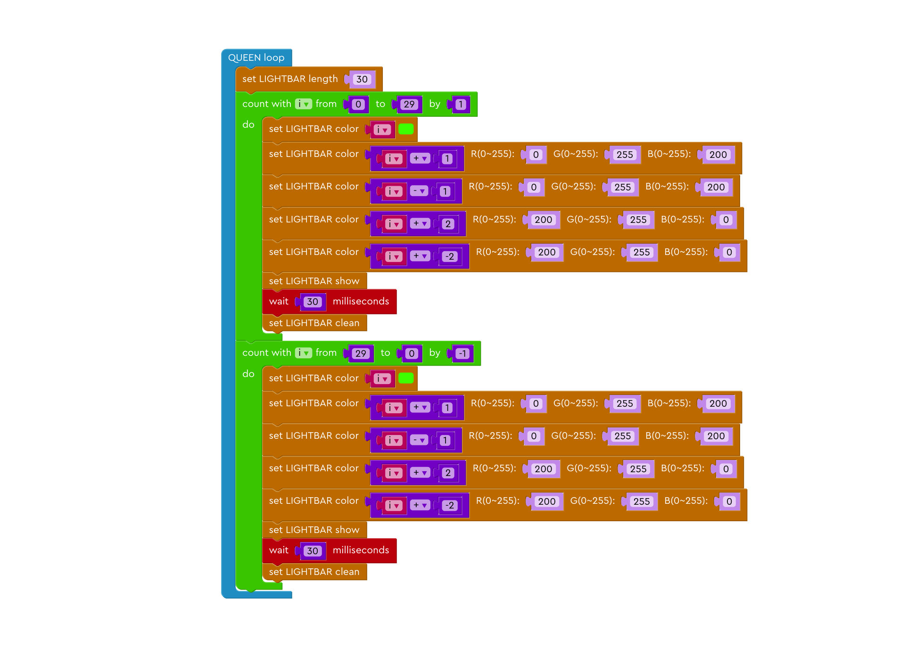

This function mainly consists of two loops, each responsible for traveling in one of the two directions. In the first loop, the ligth particles travel away from the Queen block until they hit the other end, and in the second loop, the particles travel back towards the Queen block until they hit the end.

Click here to view source code

    void loop() {
        for (i = 0; i <= 29; i++) {
            strip.setPixelColor(i, strip.Color(0, 255, 0));
            strip.setPixelColor((i + 1), strip.Color(0, 255, 200));
            strip.setPixelColor((i - 1), strip.Color(0, 255, 200));
            strip.setPixelColor((i + 2), strip.Color(200, 255, 0));
            strip.setPixelColor((i + -2), strip.Color(200, 255, 0));
            strip.show();
            delay(30);
            for (int i = 0; i < PIXEL_COUNT; i++) {
                strip.setPixelColor(i, strip.Color(0, 0, 0));
            }
            strip.show();
        }
        for (i = 29; i >= 0; i--) {
            strip.setPixelColor(i, strip.Color(0, 255, 0));
            strip.setPixelColor((i + 1), strip.Color(0, 255, 200));
            strip.setPixelColor((i - 1), strip.Color(0, 255, 200));
            strip.setPixelColor((i + 2), strip.Color(200, 255, 0));
            strip.setPixelColor((i + -2), strip.Color(200, 255, 0));
            strip.show();
            delay(30);
            for (int i = 0; i < PIXEL_COUNT; i++) {
                strip.setPixelColor(i, strip.Color(0, 0, 0));
            }
            strip.show();
        }

    }

   

## Moving Particles

(<a href="./sampleGames/moveWithJoystick.xml" download>Click here to download</a>)

Put your LED light strip down in a long line and connect the JOYSTICK block to the left of QUEEN. You can move three light particles of different color with your joystick by moving it left and right, and you can change their colors by moving the joystick up and down.

> TODO: Add pic/gif here

### Code Expert
---

#### 1. QUEEN setup

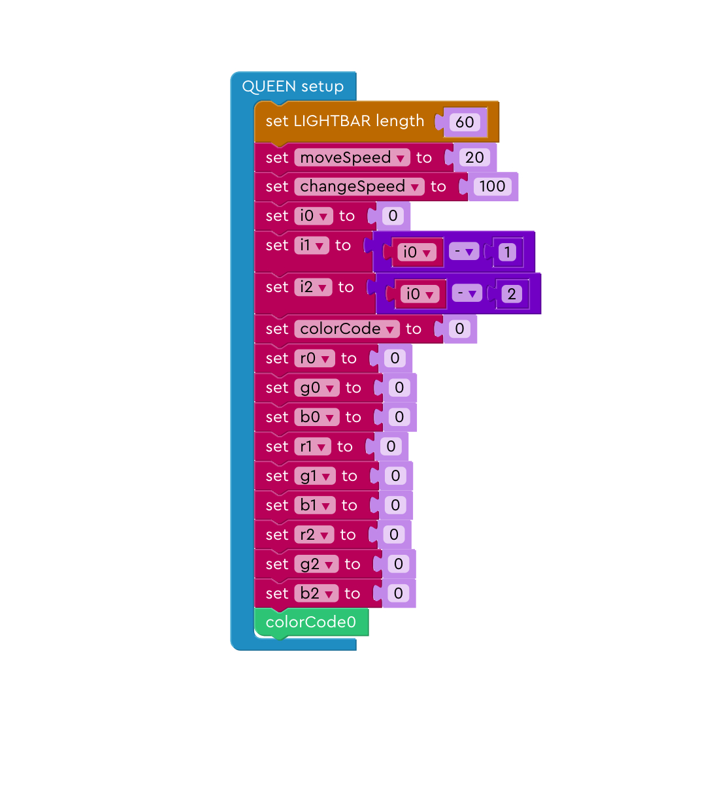

This function sets all the variables to respective values. To elaborate, i0, i1, and i2 represent the position of the light particles, colorCode is used to represents the current color combination, and nine r, g, b variables ending in number 0, 1, and 2 are used to represent the RGB color of corresponding light bulb i0, i1, and i2.

Click here to view source code

    void setup() {
        startupMelody();
        strip.begin();
        strip.show();

        HCPortInit();
        digital.init();

        moveSpeed = 20;
        changeSpeed = 100;
        i0 = 0;
        i1 = i0 - 1;
        i2 = i0 - 2;
        colorCode = 0;
        r0 = 0;
        g0 = 0;
        b0 = 0;
        r1 = 0;
        g1 = 0;
        b1 = 0;
        r2 = 0;
        g2 = 0;
        b2 = 0;
        colorCode0();

    }

   

#### 2. QUEEN loop

This function reads the input from the JOYSTICK block. If the joystick is moving left or right, it changes position of the light particles to left or right. If the joystick is moving up or down, it changes the color combination of the light particles.

Click here to view source code

    void loop() {
        digital.receive();
        if (digital.getJoystickX() > 190) {
            show();
            if (i0 < 60) {
                i0 += 1;
                i1 += 1;
                i2 += 1;
            }
            delay(moveSpeed);
        } else if (digital.getJoystickX() < 60) {
            show();
            if (i2 >= 0) {
                i0 += -1;
                i1 += -1;
                i2 += -1;
            }
            delay(moveSpeed);
        } else if (digital.getJoystickY() > 190 || digital.getJoystickY() < 60) {
            colorChange();
            show();
            delay(changeSpeed);
        }

    }

   

#### 3. colorCode0 to colorCode7

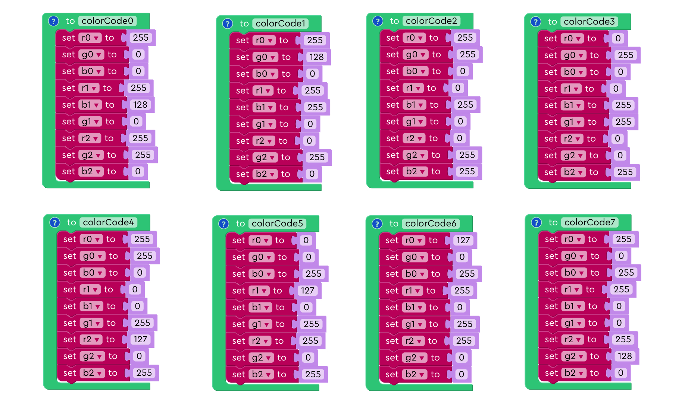

This function sets the color of the light particles to different color. There are eight color combinations in total.

Click here to view source code

    int colorCode0() {
        r0 = 255;
        g0 = 0;
        b0 = 0;
        r1 = 255;
        b1 = 128;
        g1 = 0;
        r2 = 255;
        g2 = 255;
        b2 = 0;
    }

    int colorCode1() {
        r0 = 255;
        g0 = 128;
        b0 = 0;
        r1 = 255;
        b1 = 255;
        g1 = 0;
        r2 = 0;
        g2 = 255;
        b2 = 0;
    }

    int colorCode2() {
        r0 = 255;
        g0 = 255;
        b0 = 0;
        r1 = 0;
        b1 = 255;
        g1 = 0;
        r2 = 0;
        g2 = 255;
        b2 = 255;
    }

    int colorCode3() {
        r0 = 0;
        g0 = 255;
        b0 = 0;
        r1 = 0;
        b1 = 255;
        g1 = 255;
        r2 = 0;
        g2 = 0;
        b2 = 255;
    }

    int colorCode4() {
        r0 = 255;
        g0 = 255;
        b0 = 0;
        r1 = 0;
        b1 = 0;
        g1 = 255;
        r2 = 127;
        g2 = 0;
        b2 = 255;
    }

    int colorCode5() {
        r0 = 0;
        g0 = 0;
        b0 = 255;
        r1 = 127;
        b1 = 0;
        g1 = 255;
        r2 = 255;
        g2 = 0;
        b2 = 255;
    }

    int colorCode6() {
        r0 = 127;
        g0 = 0;
        b0 = 255;
        r1 = 255;
        b1 = 0;
        g1 = 255;
        r2 = 255;
        g2 = 0;
        b2 = 0;
    }

    int colorCode7() {
        r0 = 255;
        g0 = 0;
        b0 = 255;
        r1 = 255;
        b1 = 0;
        g1 = 0;
        r2 = 255;
        g2 = 128;
        b2 = 0;
    }

   

#### 4. colorChange

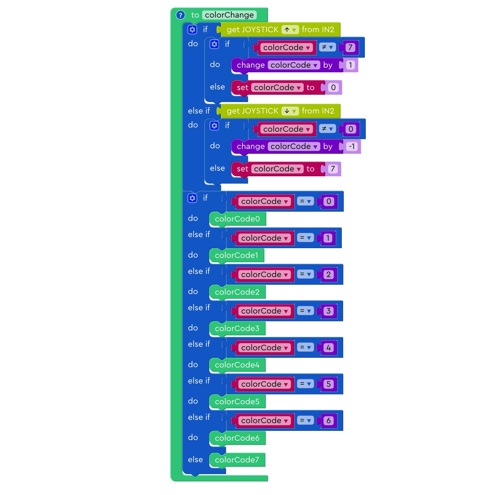

This function changes the value of colorCode based on the input from JOYSTICK block, then it calls on correspnding functions to assign different RGB values that are unique to the current colorCode.

Click here to view source code

    int colorChange() {
        if (digital.getJoystickY() > 190) {
            if (colorCode != 7) {
                colorCode += 1;
            } else {
                colorCode = 0;
            }
        } else if (digital.getJoystickY() < 60) {
            if (colorCode != 0) {
                colorCode += -1;
            } else {
                colorCode = 7;
            }
        }
        if (colorCode == 0) {
            colorCode0();
        } else if (colorCode == 1) {
            colorCode1();
        } else if (colorCode == 2) {
            colorCode2();
        } else if (colorCode == 3) {
            colorCode3();
        } else if (colorCode == 4) {
            colorCode4();
        } else if (colorCode == 5) {
            colorCode5();
        } else if (colorCode == 6) {
            colorCode6();
        } else {
            colorCode7();
        }
    }

   

#### 5. show

This function assigns three sets of RGB values to respective light particles. The purpose of cleaning the light bar at the beginning is to avoid the previous light particles to leave any trails. 

Click here to view source code

    int show() {
        for (int i = 0; i < PIXEL_COUNT; i++) {
            strip.setPixelColor(i, strip.Color(0, 0, 0));
        }
        strip.show();
        strip.setPixelColor(i0, strip.Color(r0, g0, b0));
        strip.setPixelColor(i1, strip.Color(r1, g1, b1));
        strip.setPixelColor(i2, strip.Color(r2, g2, b2));
        strip.show();
    }

   
