# Lesson

## Lesson 1

### Step 1: Basic Setup

Right for output.

### Step 2: Light up a bulb 1

Drag “set LIGHT BAR length” into QUEEN Setup.

### Step 3: Light up a bulb 2

Drag the block “set LIGHT BAR color”  to QUEEN Loop.

### Step 4: Light up a bulb 3

Drag the block “set LIGHT BAR show”  under the previous block.

### Step 5: Change color

Change the color of the light bulb to blue.

### Step 6: Change color 2

Change the color of the light bulb to a color you want.

### Step 7: Change position

Change the number of the “set LIGHT BAR color” block so that a bulb at position 1 lights up.

### Step 8: Change position 2

Try to light up the bulb at position 3.

### Step 9: Light up two bulbs 1

Drag another “set LIGHT BAR color” block under the previous one.

### Step 10:  Light up two bulbs 2

Change the number of the new “set LIGHT BAR color” block to 2.

### Step 11: Delete the Last Block

Delete the last block so that only the first and second bulbs lights up.

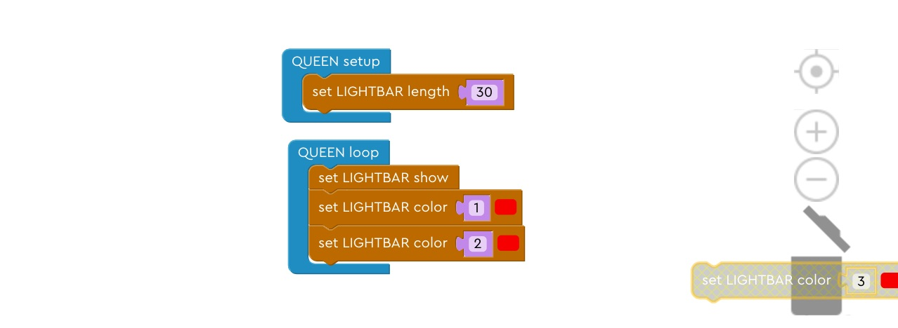

### Step 12: Delete the Middle Block

Delete the middle block so that only the first and third bulbs lights up.

### Step 13: Light up a bulb using RGB

Use the block that set LIGHT BAR color using RGB.

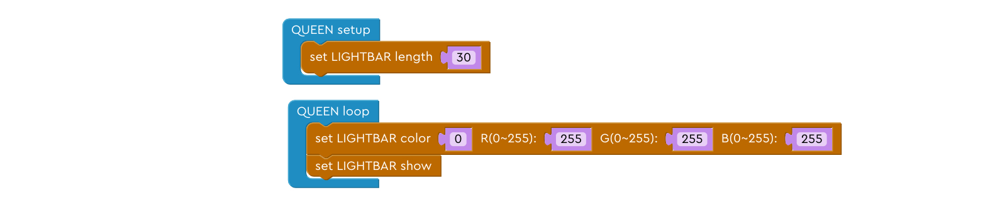

### Step 14: Change RGB numbers 1

Change G & B number to 0, see what color you get!

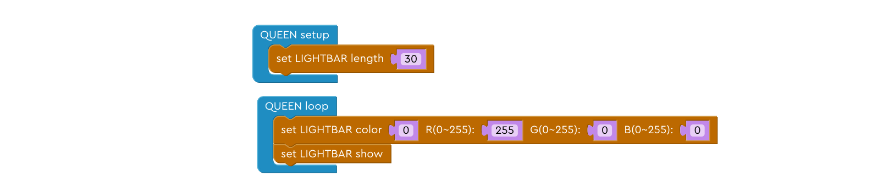

### Step 15: Change RGB numbers 2

Change R & G number to 0, see what color you get!

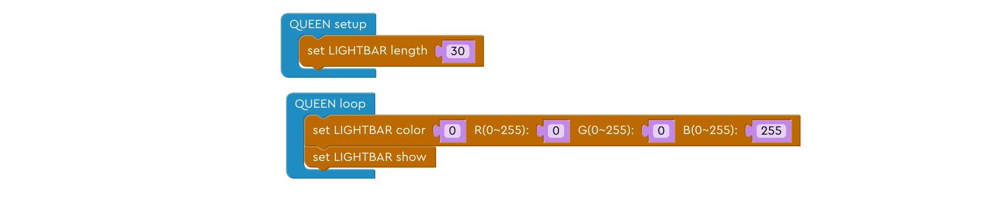

### Step 16: Change RGB numbers 2

Change R & B number to 0, see what color you get!

### Step 17: Light up two red light bulbs

Light up two light bulbs to red using different blocks.

## Lesson 2

### Step 1: Random Red 1

Drag “set item to 0” block to the top and rename “item” to “r”.

### Step 2: Random Red 2

Drag “random number integer” block to the right of the previous block, replacing the “0” block.

### Step 3: Random Red 3

Replace the number for R in the “set LIGHT BAR color” block with “item” block, and change “item” to “r”.

### Step 4: Random Green 1

Repeat this for green. Drag “set item to 0” block to the top and rename “item” to “g”. Use a random integer to replace number “0”.

### Step 5: Random Green 2

Replace the number for G in the “set LIGHT BAR color” block with “item” block, and change “item” to “g”.

### Step 6: Random Blue

Try to repeat the same process we did to red and green to the color blue.

### Step 7: Iterate 1

Drag “count with i with” block out and place it on the very top.

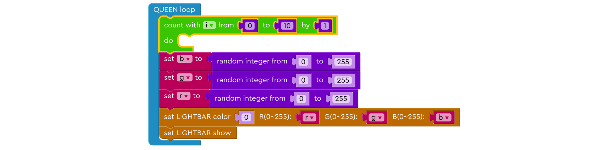

### Step 8: Iterate 2

Change the number of the “count” block to “from 0 to 29”

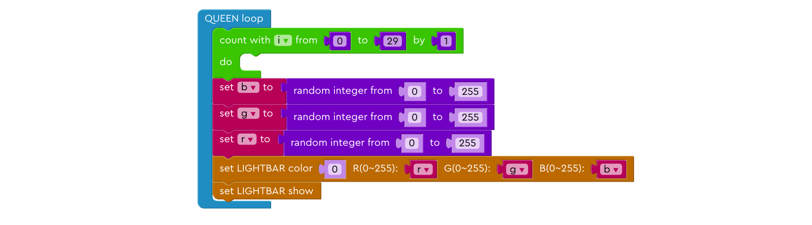

### Step 9: Iterate 3

Drag everything below the “count” block inside the block.

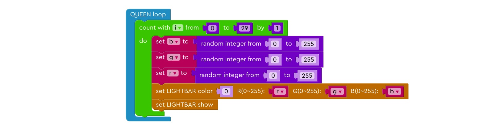

### Step 10: Iterate 4

Change the number in the “set LIGHT BAR color” to variable “i”

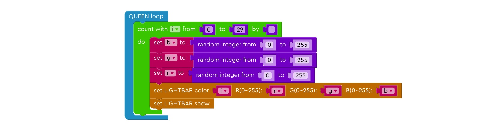

### Step 11: Lighting up the entire light strip

Drag the “set LIGHT BAR clean” block out of the “count” block and put it at the end of the program.

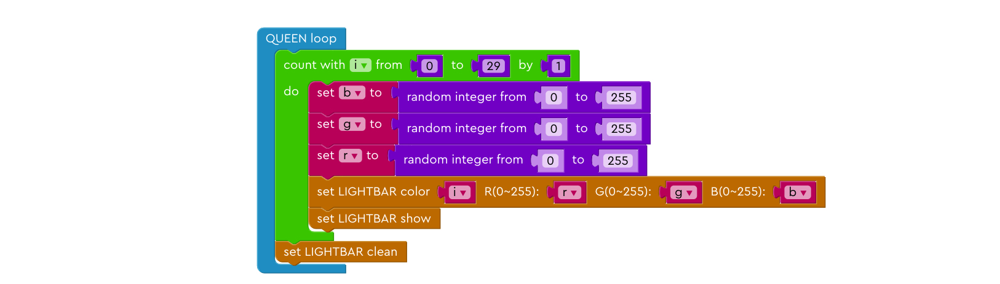

### Step 12: Dim 1

Drag “count with i with” block out and place it under the first “count” block.

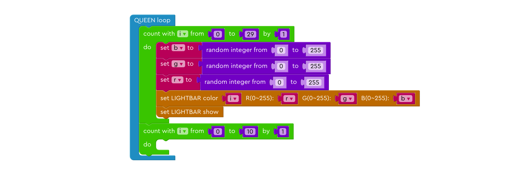

### Step 13: Dim 2

Change the number of the “count” block to “from 29 to 0 by -1”.

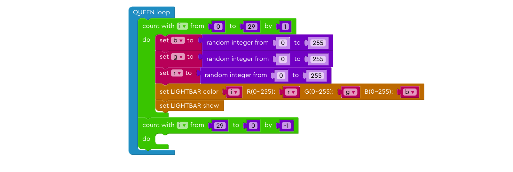

### Step 14: Dim 3

Drag a “set LIGHT BAR color” block and put it in the second “count” block.

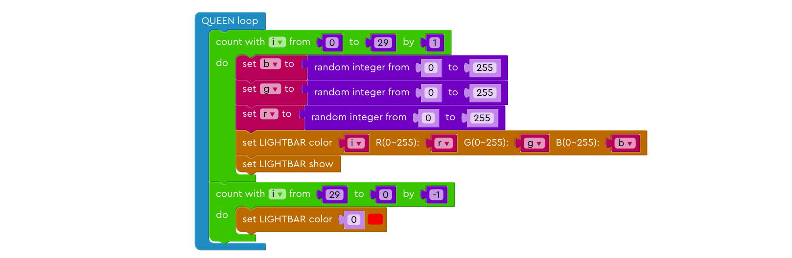

### Step 15: Dim 4

Set the color of to black (i.e. no light), and change the position parameter to “i”

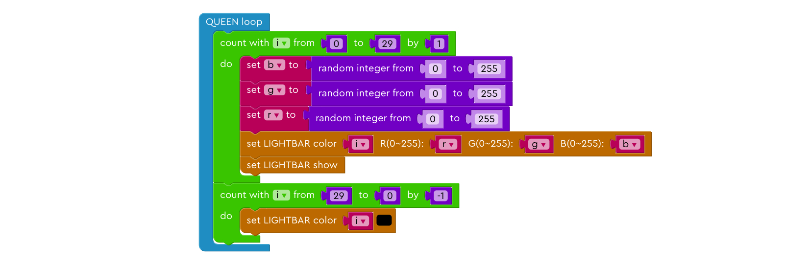
