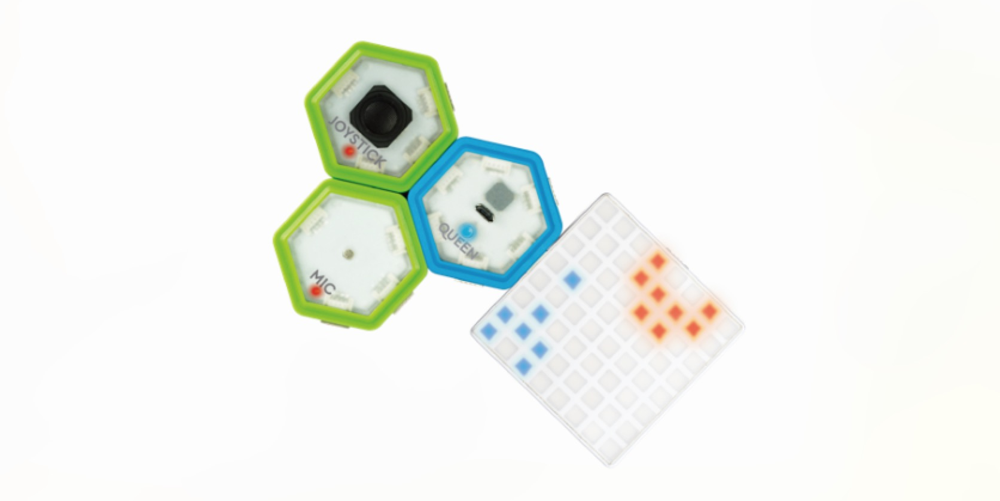

# Creating Sprite Run Game!

Have you ever played Super Mario Run?

Well, it's actually easy to build a game that is just like Super Mario Run! Let's use our Light Game Kit to create a fun game called **Sprite Run**! 

---

## Getting Started!

Before we get started on coding, it is important to make sure that we have everything connected.

### Step 1

Make sure you have downloaded our software and driver on your computer. If you haven't, you can download them here: 
<a href="http://microcn.org/" target="_blank">JUKU Download</a>

After you have successfully downloaded JUKU app on your computer, it's time to assemble the kit! 

### Step 2

Plug the USB cord into QUEEN module, and connect it to your computer.

### Step 3

Connect the light board to the **right** of the QUEEN module, as shown below.

 //TODO: change picture

### Step 4

Conenct the joystick to the **left** of the QUEEN module, as shown below.
 //TODO: change picture

**Now that we have assembled our kit, let's get to making the game!**

---

## Fun Code!

### Lesson 1. Build the user Interface

#### Step 1: Create our Sprite

Our sprite will be jumping up and down, and it doesn't have a body yet, so we need to draw its body on the board.

#### Step 2: Create the Roads

We also need something that our sprite will jump on, otherwise it will float in the air! 

#### Step 3: Create the setup of the game

At the beginning of the game, we want to set the score to 0, otherwise it wouldn't be fair! We also want to put our sprite and the roads to a certain position, so that they will not be running around!

#### Step 4: Setting up the game

Now that we have created the setup of the game, we will put the function we created in step 3 in the Queen Setup. This way, we are telling the Queen to do what we want the game to do!

#### Step 5: Sprite Run cover image

Remember when you open an app on your phone, you click on its cover image icon? We are creating our own cover image here!

### Lesson 2. Set the Controls

#### Step 1: Creating SpriteFly

We want to control the sprite to jump up, so let's create a function that tells the sprite to jump. We name the function SpriteFly. 

#### Step 2: When can sprite jump?

In our life experience, can we jump mid-air? No! So it only makes sense that the sprite can jump only when it is standing on the road. We also want the sprite to jump only when we want it to, so we use an if-statement, telling the sprite that it can only jump when it is standing on the road and when we are telling it to jump.

#### Step 3: Jump!

When sprite jump, it moves up. We can do this by simply changing its y-coordinates on the light board up!

#### Step 4: Telling the Queen

As we did with the setup of the game, we need to tell the Queen what we want it to do. Therefore, we move the function block to Queen loop.

#### Step 5: Falling down...

After the sprite jumps, it needs to come down to the road, because it can't stay up forever! 

#### Step 6: Game over?

When the sprite has fallen down, we need to see if it lands on ground or falls between the crack. If it lands in crack, then Game Over!

#### Step 7: Setting intervals

In our program, we don't know when someone will move the joystick and tell the sprite to jump. Therefore, we need to check constantly if the sprite has jumped up and needs to fall down.

### Lesson 3. Writing Rules for **Sprite Run**

#### Step 1: Shifting the roads

Since we only allow the sprite to jump up and down, the road underneath it needs to shift. Here, we shift the road to the left so that we can see the cracks coming!

#### Step 2: Generating new roads

After the one road disappears, another road should appear and take it's place. Otherwise, no matter how far our sprite can jump, it has nothing to land on!

#### Step 3: Setting intervals

Same with spriteFall, we don't know when the roads run out, and we need to shift the roads constantly, so we need to constantly move the road and generate new roads.

### Lesson 4. Scoring System

#### Step 1: Increase the scores!

Whenever the sprite jumps over a crack, the score should increases by 1. Here, we've helped you and calculated the conditions under which the sprite jumps over a crack successfully!

#### Step 2: Setting intervals

You should have guessed by now, we need to check constantly if the sprite has jumped over the crack successfully and update the score if necessary.

