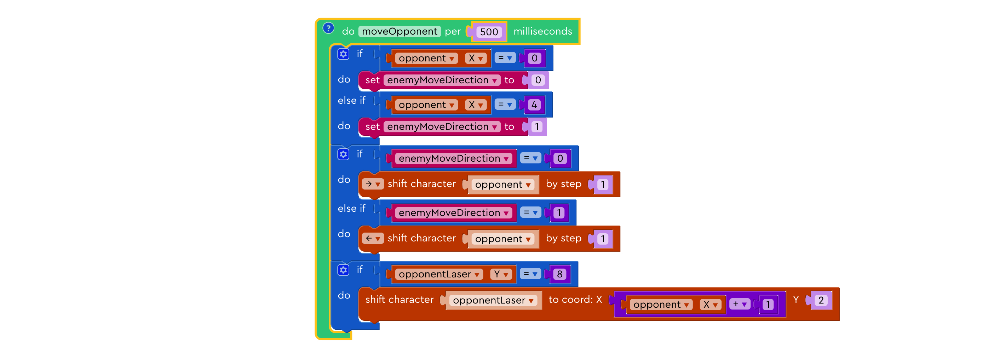
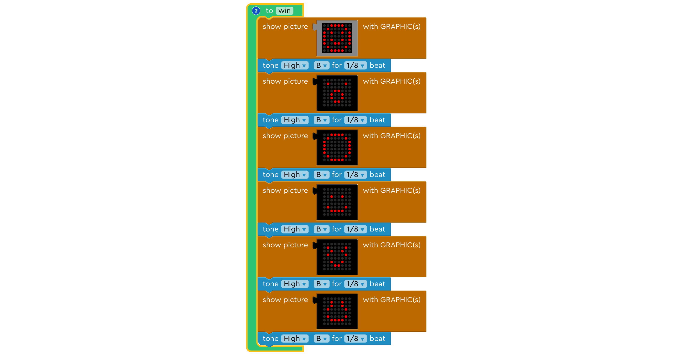
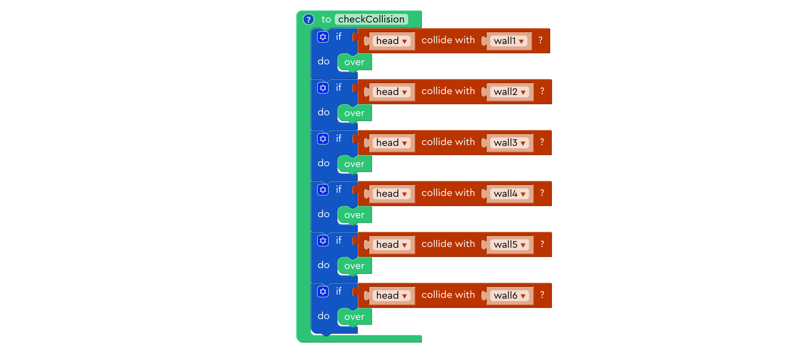
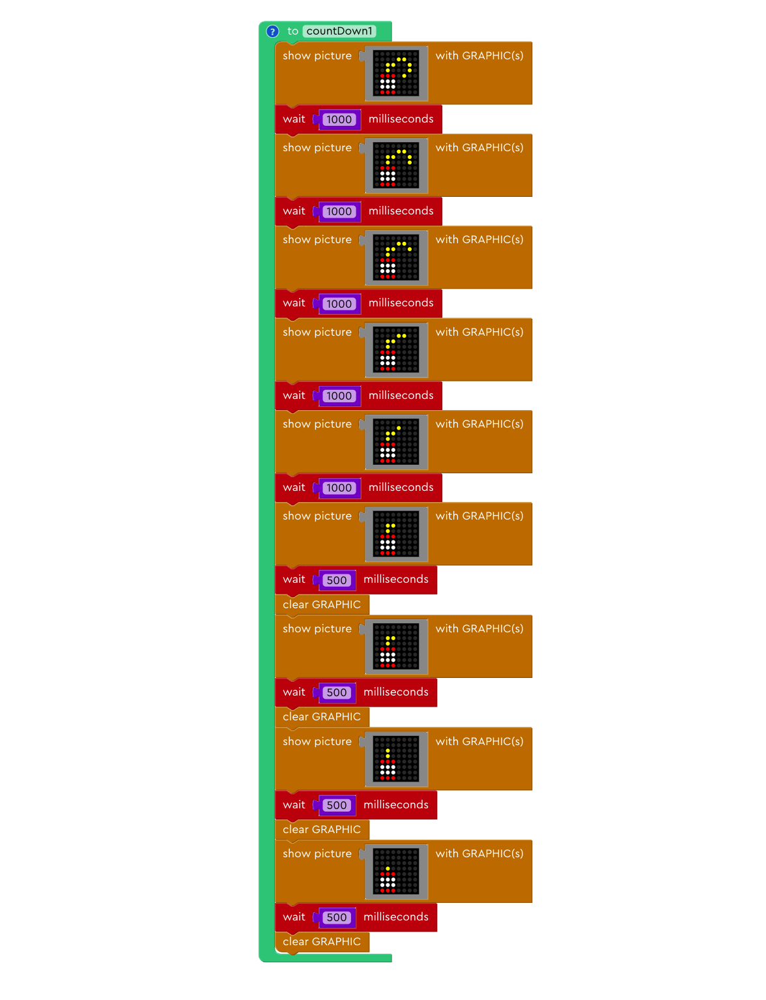
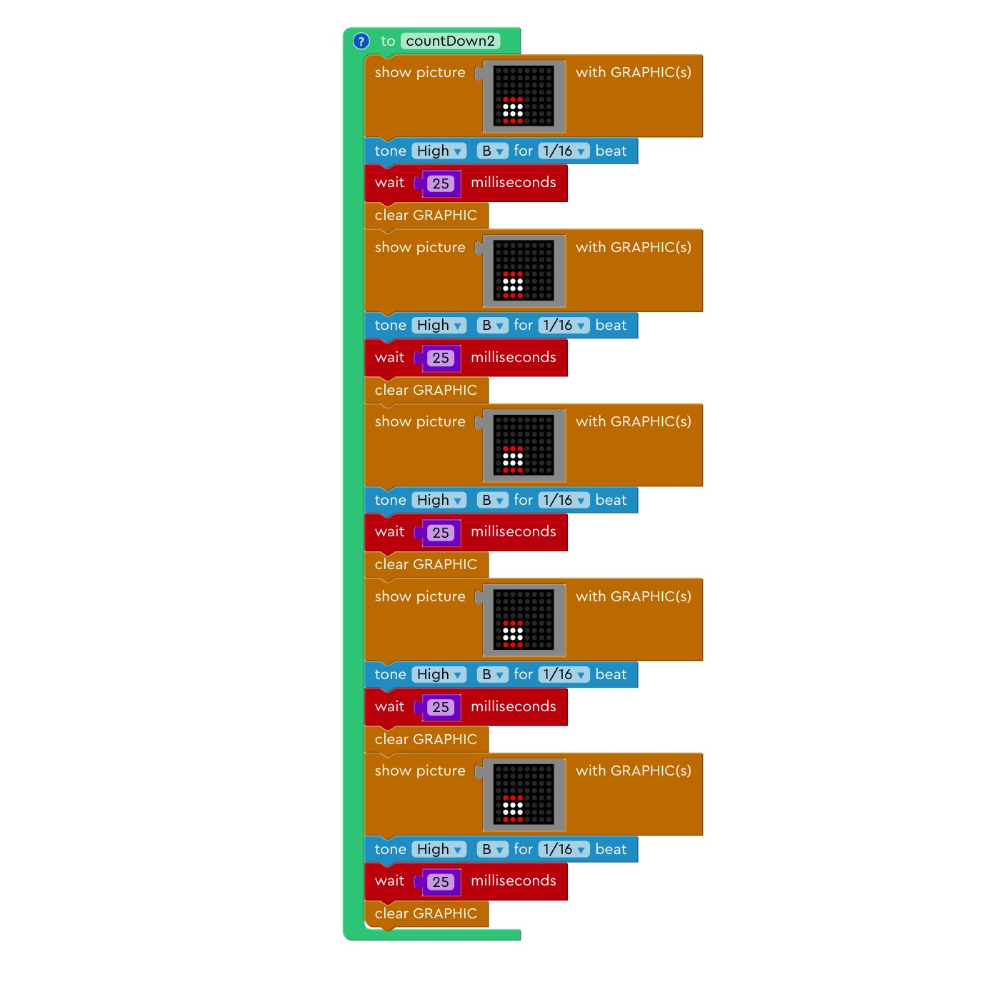
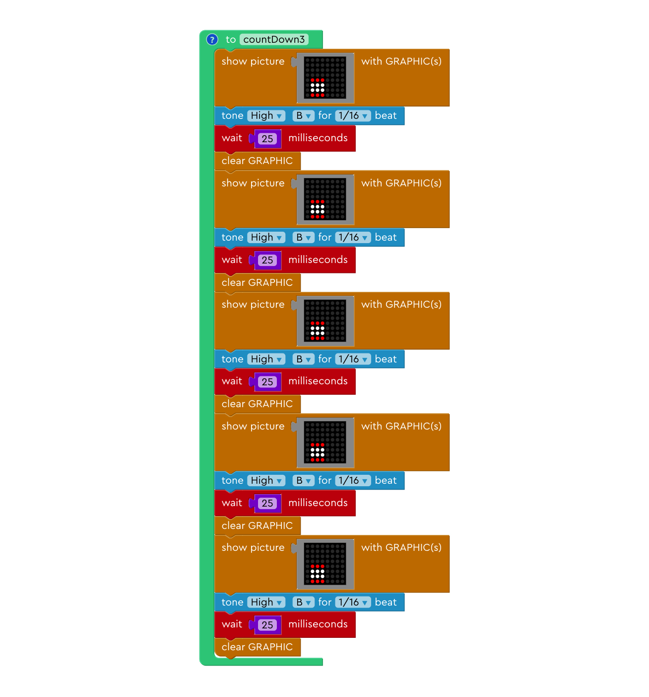
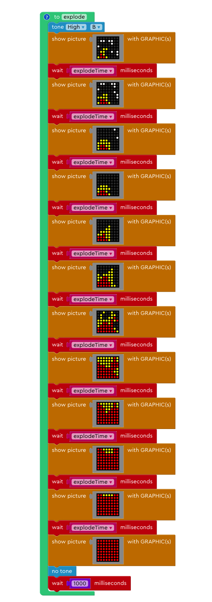
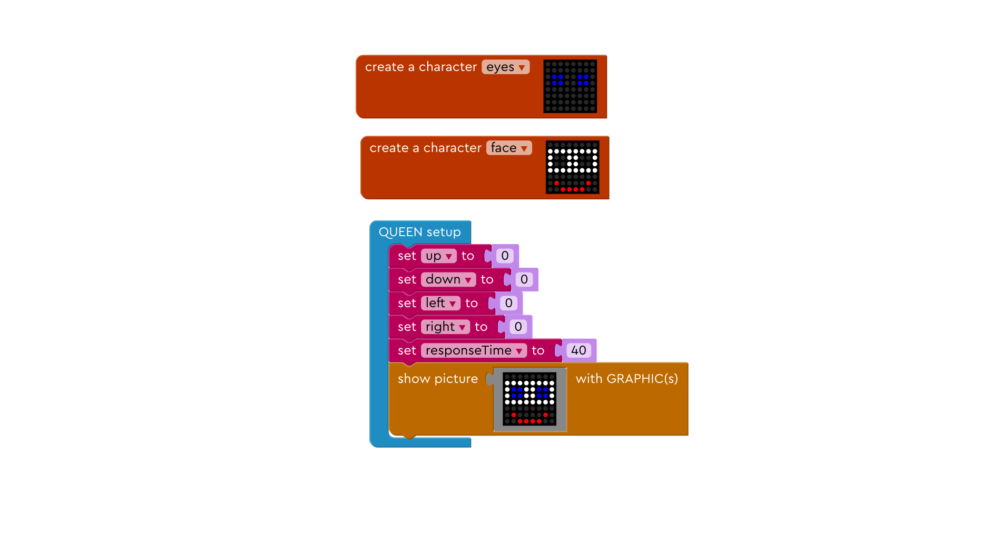

# More Games For You!

We created some more games for you to learn and play! Find the games you want to play and download them to your Light Kit!

- [Laser Tag](#laser-tag)

- [Juku Bird](#juku-bird)

- [Vital Capacity Calculator](#vital-capacity-calculator)

- [Exploding TNT](#exploding-tnt)

- [Wandering Eyes](#wandering-eyes)

---

## Laser Tag 

(<a href="./sampleGames/laserTag.xml" download>Click here to download</a>)

Control your ship, keep it from getting hit, and defeat your enemy!

### Game Rule
---

In this game, you can move your ship with the joystick module, and fire laser at enemy's ship using mic module.

You and your opponent both have 5 lives. Dodge enemy's bullet and pick the right time to shot! 

Good luck!

### Code Expert
---

#### 1. moveMyself

This function reads Joystick data, and move your ship left and right on the display accordingly. It also prevents you from moving your ship out of the display.

Click here to view source code

    void moveMyself() {
        if (digital.getJoystickX() < 60) {
            game.shiftCharacterByStep(&hc_game_character_me, 1, SHIFT_DIR_LEFT);
        } else if (digital.getJoystickX() > 190) {
            game.shiftCharacterByStep(&hc_game_character_me, 1, SHIFT_DIR_RIGHT);
        }
        hc_game_character_me.x = ((hc_game_character_me.x < 0 ? 0 : (hc_game_character_me.x > 5 ? 5 : hc_game_character_me.x)));
    }

   

#### 2. moveMyLaser

This function moves the laser dot you shoot upward towards the enemy's ship.

Click here to view source code

    int moveMyLaser() {
        if (hc_game_character_myLaser.y <= 5 && hc_game_character_myLaser.y > -1) {
            game.shiftCharacterByStep(&hc_game_character_myLaser, 1, SHIFT_DIR_UP);
        }
    }

   

#### 3. moveOpponent

This function moves the enemy's ship left and right automatically. Once the enemy's ship hits the boundary of the display, it changes direction move toward the opposite side.

Click here to view source code

    void moveOpponent() {
        if (hc_game_character_opponent.x == 0) {
            enemyMoveDirection = 0;
        } else if (hc_game_character_opponent.x == 4) {
            enemyMoveDirection = 1;
        }
        if (enemyMoveDirection == 0) {
            game.shiftCharacterByStep(&hc_game_character_opponent, 1, SHIFT_DIR_RIGHT);
        } else if (enemyMoveDirection == 1) {
            game.shiftCharacterByStep(&hc_game_character_opponent, 1, SHIFT_DIR_LEFT);
        }
        if (hc_game_character_opponentLaser.y == 8) {
            game.shiftCharacterToCoord(&hc_game_character_opponentLaser, (hc_game_character_opponent.x + 1), 2);
        }
    }

   

#### 4. moveOpponentLaser

This function the laser dot the enemy ship shoots downward towards your ship.

Click here to view source code

    int moveOpponentLaser() {
        if (hc_game_character_opponentLaser.y < 8 && hc_game_character_opponentLaser.y >= 2) {
            game.shiftCharacterByStep(&hc_game_character_opponentLaser, 1, SHIFT_DIR_DOWN);
        }
    }

   

#### 5. checkOpponentDamage

This function the laser dot the enemy ship shoots downward towards your ship. If enemy ship touches your laser dot, the ship's damage increase by one, the ship flashes, and plays a beat to indicate that the enemy's ship has been hit.

Click here to view source code

    int checkOpponentDamage() {
        hc_game_character_opponent.visibility = true;
        if (game.isCollsion(&hc_game_character_opponent, &hc_game_character_myLaser)) {
            hc_game_character_myLaser.y = -1;
            damage += 1;
            hc_game_character_opponent.visibility = false;
            tone(8, NOTE_CH7);
            delay(62);
            noTone(8);
        }
    }

   

#### 6. calculateDamage

This function responds only when the "damage" variable is equal to or greater than 5. If so, it changes the coordinates of the opponent's ship, and calls the function "win".

Click here to view source code

    int calculateDamage() {
        if (damage >= 5) {
            hc_game_character_opponent.x = 8;
            enemyMoveDirection = 2;
            game.shiftCharacterByStep(&hc_game_character_me, 1, SHIFT_DIR_UP);
            if (hc_game_character_me.y == -3) {
                start = 0;
                win();
            }
        }
    }

   

#### 7. win

This function displays a series of emojis accompanied by a short sound to indicate victory.

Click here to view source code

int win() {
        {
            byte rgbData[1][3][8] = {{{60, 66, 165, 129, 165, 153, 66, 60}, {0, 0, 0, 0, 0, 0, 0, 0}, {0, 0, 0, 0, 0, 0, 0, 0}}};
            matrix.showRGBLeds(rgbData[0], 0);
        }
        tone(8, NOTE_CH7);
        delay(62);
        noTone(8);
        {
            byte rgbData[1][3][8] = {{{0, 66, 0, 24, 36, 36, 24, 0}, {0, 0, 0, 0, 0, 0, 0, 0}, {0, 0, 0, 0, 0, 0, 0, 0}}};
            matrix.showRGBLeds(rgbData[0], 0);
        }
        tone(8, NOTE_CH7);
        delay(62);
        noTone(8);
        {
            byte rgbData[1][3][8] = {{{60, 66, 129, 129, 129, 129, 66, 60}, {0, 0, 0, 0, 0, 0, 0, 0}, {0, 0, 0, 0, 0, 0, 0, 0}}};
            matrix.showRGBLeds(rgbData[0], 0);
        }
        tone(8, NOTE_CH7);
        delay(62);
        noTone(8);
        {
            byte rgbData[1][3][8] = {{{0, 0, 36, 0, 0, 66, 60, 0}, {0, 0, 0, 0, 0, 0, 0, 0}, {0, 0, 0, 0, 0, 0, 0, 0}}};
            matrix.showRGBLeds(rgbData[0], 0);
        }
        tone(8, NOTE_CH7);
        delay(62);
        noTone(8);
        {
            byte rgbData[1][3][8] = {{{0, 66, 36, 66, 0, 36, 24, 0}, {0, 0, 0, 0, 0, 0, 0, 0}, {0, 0, 0, 0, 0, 0, 0, 0}}};
            matrix.showRGBLeds(rgbData[0], 0);
        }
        tone(8, NOTE_CH7);
        delay(62);
        noTone(8);
        {
            byte rgbData[1][3][8] = {{{0, 36, 36, 66, 0, 66, 60, 0}, {0, 0, 0, 0, 0, 0, 0, 0}, {0, 0, 0, 0, 0, 0, 0, 0}}};
            matrix.showRGBLeds(rgbData[0], 0);
        }
        tone(8, NOTE_CH7);
        delay(62);
        noTone(8);
    }

   

#### 8. over

This function checks if your ship is hit by enemy's laser dot. If yes, it increases your damage by 1, your ship flashes, and plays a beat to indicate that your ship has been hit. It also checks if your damage is equal to or greater than 5. If yes, you are defeated and the program ends.

Click here to view source code

    int over() {
        hc_game_character_me.visibility = true;
        if (game.isCollsion(&hc_game_character_me, &hc_game_character_opponentLaser)) {
            hc_game_character_opponentLaser.y = 8;
            myDamage += 1;
            hc_game_character_me.visibility = false;
            tone(8, NOTE_CH7);
            delay(62);
            noTone(8);
        }
        if (myDamage >= 5) {
            gameOver();
            start = 0;
        }
    }

   

---
## Juku Bird 

(<a href="./sampleGames/jukuBird.xml" download>Click here to download</a>)

Keep the little bird from hitting the walls!

### Game Rule
---

Move joystick in any direction to fly up your bird. The bird flys down when you do not move the joystick. See how many walls you can get past!

### Code Expert
---

#### 1. fly

This function constantly checks if there are inputs from the joystick module. If yes, this function moves the head of the bird upwards by one, and moves the tail of the bird to corresponding position every 80 milliseconds.

Click here to view source code

    void fly() {
        if (analogRead(IN2) > 500) {
            game.shiftCharacterByStep(&hc_game_character_head, 1, SHIFT_DIR_UP);
            game.keepCharacterWithinGraphic(&hc_game_character_head, SCREEN_NUMBER);
            hc_game_character_tail.y = (hc_game_character_head.y + 1);
        }
    }

   

#### 2. fall

This function moves the head of the bird down by one, and moves the tail of the bird to corresponding position every 300 milliseconds.

Click here to view source code

    void fall() {
        if (start == 1) {
            count += 1;
            if (count >= 5) {
                game.shiftCharacterByStep(&hc_game_character_head, 1, SHIFT_DIR_DOWN);
                game.keepCharacterWithinGraphic(&hc_game_character_head, SCREEN_NUMBER);
                hc_game_character_tail.y = (hc_game_character_head.y - 1);
                count = 0;
            }
            hc_game_character_tail.visibility = !hc_game_character_tail.visibility;
        }
    }

   

#### 3. checkCollision

This function checks if the head of the bird checks any of the six walls. If yes, then the game is over.

Click here to view source code

    int checkCollision() {
        if (game.isCollsion(&hc_game_character_head, &hc_game_character_wall1)) {
            over();
        }
        if (game.isCollsion(&hc_game_character_head, &hc_game_character_wall2)) {
            over();
        }
        if (game.isCollsion(&hc_game_character_head, &hc_game_character_wall3)) {
            over();
        }
        if (game.isCollsion(&hc_game_character_head, &hc_game_character_wall4)) {
            over();
        }
        if (game.isCollsion(&hc_game_character_head, &hc_game_character_wall5)) {
            over();
        }
        if (game.isCollsion(&hc_game_character_head, &hc_game_character_wall6)) {
            over();
        }
    }

   

#### 4. moveWall

This function moves two of the six walls in specific order at specific speed.

Click here to view source code

    void move_wall() {
        moveWallCount += 1;
        if (moveWallCount >= moveWallSpeed) {
            moveWallCount = 0;
            if (start == 1) {
                moveCount += 1;
                if (moveCount == 10) {
                    moveCount = 0;
                    upperWallFlag = random(1, 4);
                    lowerWallFlag = random(1, 4);
                    hc_game_score += 1;
                }
                if (hc_game_character_wall1.x <= 8) {
                    game.shiftCharacterByStep(&hc_game_character_wall1, 1, SHIFT_DIR_LEFT);
                    if (hc_game_character_wall1.x <= -2) {
                        hc_game_character_wall1.x = 9;
                    }
                }
                if (hc_game_character_wall2.x <= 8) {
                    game.shiftCharacterByStep(&hc_game_character_wall2, 1, SHIFT_DIR_LEFT);
                    if (hc_game_character_wall2.x <= -2) {
                        hc_game_character_wall2.x = 9;
                    }
                }
                if (hc_game_character_wall3.x <= 8) {
                    game.shiftCharacterByStep(&hc_game_character_wall3, 1, SHIFT_DIR_LEFT);
                    if (hc_game_character_wall3.x <= -2) {
                        hc_game_character_wall3.x = 9;
                    }
                }
                if (hc_game_character_wall4.x <= 8) {
                    game.shiftCharacterByStep(&hc_game_character_wall4, 1, SHIFT_DIR_LEFT);
                    if (hc_game_character_wall4.x <= -2) {
                        hc_game_character_wall4.x = 9;
                    }
                }
                if (hc_game_character_wall5.x <= 8) {
                    game.shiftCharacterByStep(&hc_game_character_wall5, 1, SHIFT_DIR_LEFT);
                    if (hc_game_character_wall5.x <= -2) {
                        hc_game_character_wall5.x = 9;
                    }
                }
                if (hc_game_character_wall6.x <= 8) {
                    game.shiftCharacterByStep(&hc_game_character_wall6, 1, SHIFT_DIR_LEFT);
                    if (hc_game_character_wall6.x <= -2) {
                        hc_game_character_wall6.x = 9;
                    }
                }
                if (upperWallFlag == 1) {
                    hc_game_character_wall1.x = 8;
                } else if (upperWallFlag == 2) {
                    hc_game_character_wall2.x = 8;
                } else if (upperWallFlag == 3) {
                    hc_game_character_wall3.x = 8;
                }
                upperWallFlag = 0;
                if (lowerWallFlag == 1) {
                    hc_game_character_wall6.x = 8;
                } else if (lowerWallFlag == 2) {
                    hc_game_character_wall5.x = 8;
                } else if (lowerWallFlag == 3) {
                    hc_game_character_wall4.x = 8;
                }
                lowerWallFlag = 0;
            }
        }
    }

   

#### 5. QUEEN loop

This function sets the initial display of the game, the positions of all six walls. If it senses input form the joystick, the game starts. As the player gets through more walls, the speed at which the walls move increases, making the game harder. 

Click here to view source code

    void loop() {
        if (start == 0) {
            hc_game_character_wall1.x = 9;
            hc_game_character_wall2.x = 9;
            hc_game_character_wall3.x = 9;
            hc_game_character_wall4.x = 9;
            hc_game_character_wall5.x = 9;
            hc_game_character_wall6.x = 9;
            hc_game_score = -1;
            {
                byte rgbData[1][3][8] = {{{0, 0, 0, 8, 0, 0, 0, 0}, {0, 0, 0, 0, 0, 0, 0, 0}, {0, 28, 34, 66, 131, 68, 56, 0}}};
                matrix.showRGBLeds(rgbData[0], 0);
            }
            if (analogRead(IN2) > 500) {
                start = 1;
                matrix.clear();
            }
        } else {
            gameTimer.update();
            if (hc_game_score <= 10) {
                moveWallSpeed = 4;
            } else if (hc_game_score <= 20) {
                moveWallSpeed = 3;
            } else if (hc_game_score <= 30) {
                moveWallSpeed = 2;
            } else if (hc_game_score <= 40) {
                moveWallSpeed = 1;
            } else if (hc_game_score <= 50) {
                moveWallSpeed = 0;
            }
        }
        checkCollision();
        move_wallTimer.update();
        flyTimer.update();
        fallTimer.update();
    }

   

---
## Vital Capacity Calculator

(<a href="./sampleGames/vitalCapacityCalculator.xml" download>Click here to download</a>)

Keep the little bird from hitting the walls!

### Game Rule
---

This program picks up the air you blow into the mic, and assigns an index to indicate the length of your breath. The longer you blow into the mic, the larger the index is. 

### Code Expert
---

#### 1. vitalCapacityCalculator

This function checks if there are inputs from the mic. If yes, the sound stops, displays an arrow on the display, and increases the index by 50 every 100 milliseconds. If no, this function produces a sound accompanied by index display. It then sets the vital capacity to 0 and gets ready for the next round.

Click here to view source code

    void loop() {
        if (analogRead(IN2) > 500) {
            noTone(8);
            vitalCapacity += 50;
            {
                byte rgbData[1][3][8] = {{{24, 60, 126, 24, 24, 24, 24, 24}, {0, 0, 0, 0, 0, 0, 0, 0}, {0, 0, 0, 0, 0, 0, 0, 0}}};
                matrix.showRGBLeds(rgbData[0], 0);
            }
            delay(100);
        } else {
            for (int count = 0; count < 3; count++) {
                tone(8, 523);
                matrix.showString(String(vitalCapacity), RED, 1);
            }
            vitalCapacity = 0;
        }

    }

   

## Exploding TNT

(<a href="./sampleGames/explodeIfTouchMic.xml" download>Click here to download</a>)

Even the lightest whiff can set off a huge fire...

> TODO : Add pic/gif here

### Game Rule
---

This program picks up the air you blow into the mic, and starts lighting up the fuse of the TNT and enter a explosion sesquence that cannot be stopped unless the entire block 

### Code Expert
---

#### 1. QUEEN setup

This program sets the value of "explodeTime" to 35 and "start" to 0. As you can see later in the program, the "explodeTime" is used to control the time interval between the display of different images, and "start" is used to denote if a MIC value greater than 1000 has been detected. If yes, "start" changes to one, which begins the explosion sequence.

Click here to view source code

    void setup() {
        startupMelody();
        HCPortInit();

        explodeTime = 35;
        start = 0;

    }

   

#### 2. QUEEN loop

This program detects the MIC input and judges if the MIC input value is greater than 1000. If yes, it changes the "start" value to "1", and the program enters the if-else branch where the condition is "start = 1". This starts a explosion sequence, and this function calls respective functions. After the explosion, this function resets the value of "start" to "0", preventing the function to enter a second sequence.

Click here to view source code

    void loop() {
        if (start == 0) {
            {
                byte rgbData[1][3][8] = {{{0, 12, 50, 34, 116, 112, 112, 112},
                                                 {0, 12, 50, 34, 4, 112, 112, 0},
                                                 {0, 0, 0, 0, 0, 112, 112, 0}}};
                matrix.showRGBLeds(rgbData[0], 0);
            }
            if (analogRead(IN2) > 1000) {
                start = 1;
            }
        } else if (start == 1) {
            countDown1();
            countDown2();
            countDown3();
            explode();
            start = 0;
        }
    }

   

#### 3. countDown1

The first part of explosion sequence.

Click here to view source code

    int countDown1() {
        {
            byte rgbData[1][3][8] = {{{0, 12, 50, 34, 116, 112, 112, 112},
                                             {0, 12, 50, 34, 4, 112, 112, 0},
                                             {0, 0, 0, 0, 0, 112, 112, 0}}};
            matrix.showRGBLeds(rgbData[0], 0);
        }
        delay(1000);
        {
            byte rgbData[1][3][8] = {{{0, 12, 50, 34, 112, 112, 112, 112},
                                             {0, 12, 50, 34, 0, 112, 112, 0},
                                             {0, 0, 0, 0, 0, 112, 112, 0}}};
            matrix.showRGBLeds(rgbData[0], 0);
        }
        delay(1000);
        {
            byte rgbData[1][3][8] = {{{0, 12, 50, 32, 112, 112, 112, 112},
                                             {0, 12, 50, 32, 0, 112, 112, 0},
                                             {0, 0, 0, 0, 0, 112, 112, 0}}};
            matrix.showRGBLeds(rgbData[0], 0);
        }
        delay(1000);
        {
            byte rgbData[1][3][8] = {{{0, 12, 48, 32, 112, 112, 112, 112},
                                             {0, 12, 48, 32, 0, 112, 112, 0},
                                             {0, 0, 0, 0, 0, 112, 112, 0}}};
            matrix.showRGBLeds(rgbData[0], 0);
        }
        delay(1000);
        {
            byte rgbData[1][3][8] = {{{0, 8, 48, 32, 112, 112, 112, 112},
                                             {0, 8, 48, 32, 0, 112, 112, 0},
                                             {0, 0, 0, 0, 0, 112, 112, 0}}};
            matrix.showRGBLeds(rgbData[0], 0);
        }
        delay(1000);
        {
            byte rgbData[1][3][8] = {{{0, 0, 48, 32, 112, 112, 112, 112},
                                             {0, 0, 48, 32, 0, 112, 112, 0},
                                             {0, 0, 0, 0, 0, 112, 112, 0}}};
            matrix.showRGBLeds(rgbData[0], 0);
        }
        delay(500);
        matrix.clear();
        {
            byte rgbData[1][3][8] = {{{0, 0, 48, 32, 112, 112, 112, 112},
                                             {0, 0, 48, 32, 0, 112, 112, 0},
                                             {0, 0, 0, 0, 0, 112, 112, 0}}};
            matrix.showRGBLeds(rgbData[0], 0);
        }
        delay(500);
        matrix.clear();
        {
            byte rgbData[1][3][8] = {{{0, 0, 32, 32, 112, 112, 112, 112},
                                             {0, 0, 32, 32, 0, 112, 112, 0},
                                             {0, 0, 0, 0, 0, 112, 112, 0}}};
            matrix.showRGBLeds(rgbData[0], 0);
        }
        delay(500);
        matrix.clear();
        {
            byte rgbData[1][3][8] = {{{0, 0, 0, 32, 112, 112, 112, 112},
                                             {0, 0, 0, 32, 0, 112, 112, 0},
                                             {0, 0, 0, 0, 0, 112, 112, 0}}};
            matrix.showRGBLeds(rgbData[0], 0);
        }
        delay(500);
        matrix.clear();
    }

   

#### 4. countDown2
 

The second part of the explosion sequence. After each graphic is displayed, a note is played for 1/16 beat to add some exciting element to the display.

Click here to view source code

    int countDown2() {
        {
            byte rgbData[1][3][8] = {{{0, 0, 0, 0, 112, 112, 112, 112},
                                             {0, 0, 0, 0, 0, 112, 112, 0},
                                             {0, 0, 0, 0, 0, 112, 112, 0}}};
            matrix.showRGBLeds(rgbData[0], 0);
        }
        tone(8, NOTE_CH7);
        delay(31);
        noTone(8);
        delay(25);
        matrix.clear();
        {
            byte rgbData[1][3][8] = {{{0, 0, 0, 0, 112, 112, 112, 112},
                                             {0, 0, 0, 0, 0, 112, 112, 0},
                                             {0, 0, 0, 0, 0, 112, 112, 0}}};
            matrix.showRGBLeds(rgbData[0], 0);
        }
        tone(8, NOTE_CH7);
        delay(31);
        noTone(8);
        delay(25);
        matrix.clear();
        {
            byte rgbData[1][3][8] = {{{0, 0, 0, 0, 112, 112, 112, 112},
                                             {0, 0, 0, 0, 0, 112, 112, 0},
                                             {0, 0, 0, 0, 0, 112, 112, 0}}};
            matrix.showRGBLeds(rgbData[0], 0);
        }
        tone(8, NOTE_CH7);
        delay(31);
        noTone(8);
        delay(25);
        matrix.clear();
        {
            byte rgbData[1][3][8] = {{{0, 0, 0, 0, 112, 112, 112, 112},
                                             {0, 0, 0, 0, 0, 112, 112, 0},
                                             {0, 0, 0, 0, 0, 112, 112, 0}}};
            matrix.showRGBLeds(rgbData[0], 0);
        }
        tone(8, NOTE_CH7);
        delay(31);
        noTone(8);
        delay(25);
        matrix.clear();
        {
            byte rgbData[1][3][8] = {{{0, 0, 0, 0, 112, 112, 112, 112},
                                             {0, 0, 0, 0, 0, 112, 112, 0},
                                             {0, 0, 0, 0, 0, 112, 112, 0}}};
            matrix.showRGBLeds(rgbData[0], 0);
        }
        tone(8, NOTE_CH7);
        delay(31);
        noTone(8);
        delay(25);
        matrix.clear();
    }

   

#### 5. countDown3

Same with countDown2. This function can be combined with countDown2. It is separated from countDown2 to make the program more reader friendly.

Click here to view source code

int countDown3() {
        {
            byte rgbData[1][3][8] = {{{0, 0, 0, 0, 112, 112, 112, 112},
                                             {0, 0, 0, 0, 0, 112, 112, 0},
                                             {0, 0, 0, 0, 0, 112, 112, 0}}};
            matrix.showRGBLeds(rgbData[0], 0);
        }
        tone(8, NOTE_CH7);
        delay(31);
        noTone(8);
        delay(25);
        matrix.clear();
        {
            byte rgbData[1][3][8] = {{{0, 0, 0, 0, 112, 112, 112, 112},
                                             {0, 0, 0, 0, 0, 112, 112, 0},
                                             {0, 0, 0, 0, 0, 112, 112, 0}}};
            matrix.showRGBLeds(rgbData[0], 0);
        }
        tone(8, NOTE_CH7);
        delay(31);
        noTone(8);
        delay(25);
        matrix.clear();
        {
            byte rgbData[1][3][8] = {{{0, 0, 0, 0, 112, 112, 112, 112},
                                             {0, 0, 0, 0, 0, 112, 112, 0},
                                             {0, 0, 0, 0, 0, 112, 112, 0}}};
            matrix.showRGBLeds(rgbData[0], 0);
        }
        tone(8, NOTE_CH7);
        delay(31);
        noTone(8);
        delay(25);
        matrix.clear();
        {
            byte rgbData[1][3][8] = {{{0, 0, 0, 0, 112, 112, 112, 112},
                                             {0, 0, 0, 0, 0, 112, 112, 0},
                                             {0, 0, 0, 0, 0, 112, 112, 0}}};
            matrix.showRGBLeds(rgbData[0], 0);
        }
        tone(8, NOTE_CH7);
        delay(31);
        noTone(8);
        delay(25);
        matrix.clear();
        {
            byte rgbData[1][3][8] = {{{0, 0, 0, 0, 112, 112, 112, 112},
                                             {0, 0, 0, 0, 0, 112, 112, 0},
                                             {0, 0, 0, 0, 0, 112, 112, 0}}};
            matrix.showRGBLeds(rgbData[0], 0);
        }
        tone(8, NOTE_CH7);
        delay(31);
        noTone(8);
        delay(25);
        matrix.clear();
    }

   

#### 6. explode

The last part of the explosion sequence. This program plays a note along with the display until the display ends. 

Click here to view source code

    int explode() {
        tone(8, NOTE_CH7);
        {
            byte rgbData[1][3][8] = {{{0, 108, 4, 128, 48, 101, 97, 240},
                                             {0, 108, 4, 128, 48, 101, 33, 144},
                                             {0, 108, 4, 128, 0, 5, 1, 0}}};
            matrix.showRGBLeds(rgbData[0], 0);
        }
        delay(explodeTime);
        {
            byte rgbData[1][3][8] = {{{102, 2, 128, 2, 49, 241, 112, 248},
                                             {102, 2, 128, 2, 49, 241, 16, 136},
                                             {102, 2, 128, 2, 1, 1, 0, 0}}};
            matrix.showRGBLeds(rgbData[0], 0);
        }
        delay(explodeTime);
        {
            byte rgbData[1][3][8] = {{{2, 0, 0, 1, 112, 248, 248, 248},
                                             {2, 0, 0, 1, 112, 248, 152, 136},
                                             {2, 0, 0, 1, 0, 0, 0, 0}}};
            matrix.showRGBLeds(rgbData[0], 0);
        }
        delay(explodeTime);
        {
            byte rgbData[1][3][8] = {{{0, 0, 0, 0, 112, 248, 240, 248},
                                             {0, 0, 0, 0, 112, 248, 144, 8},
                                             {0, 0, 0, 0, 0, 0, 0, 0}}};
            matrix.showRGBLeds(rgbData[0], 0);
        }
        delay(explodeTime);
        {
            byte rgbData[1][3][8] = {{{0, 0, 8, 24, 120, 248, 248, 248},
                                             {0, 0, 8, 24, 120, 216, 24, 8},
                                             {0, 0, 0, 0, 0, 0, 0, 0}}};
            matrix.showRGBLeds(rgbData[0], 0);
        }
        delay(explodeTime);
        {
            byte rgbData[1][3][8] = {{{0, 4, 12, 188, 252, 252, 252, 254},
                                             {0, 4, 12, 188, 204, 140, 4, 6},
                                             {0, 0, 0, 0, 0, 0, 0, 0}}};
            matrix.showRGBLeds(rgbData[0], 0);
        }
        delay(explodeTime);
        {
            byte rgbData[1][3][8] = {{{36, 70, 78, 255, 252, 252, 254, 255},
                                             {36, 70, 76, 250, 200, 128, 2, 1},
                                             {0, 0, 0, 0, 0, 0, 0, 0}}};
            matrix.showRGBLeds(rgbData[0], 0);
        }
        delay(explodeTime);
        {
            byte rgbData[1][3][8] = {{{255, 255, 255, 255, 255, 255, 255, 255},
                                             {253, 253, 120, 24, 1, 3, 1, 0},
                                             {0, 0, 0, 0, 0, 0, 0, 0}}};
            matrix.showRGBLeds(rgbData[0], 0);
        }
        delay(explodeTime);
        {
            byte rgbData[1][3][8] = {{{255, 255, 255, 255, 255, 255, 255, 255},
                                             {125, 61, 24, 16, 0, 0, 0, 0},
                                             {0, 0, 0, 0, 0, 0, 0, 0}}};
            matrix.showRGBLeds(rgbData[0], 0);
        }
        delay(explodeTime);
        {
            byte rgbData[1][3][8] = {{{255, 255, 255, 255, 255, 255, 255, 255},
                                             {60, 28, 0, 0, 0, 0, 0, 0},
                                             {0, 0, 0, 0, 0, 0, 0, 0}}};
            matrix.showRGBLeds(rgbData[0], 0);
        }
        delay(explodeTime);
        {
            byte rgbData[1][3][8] = {{{255, 255, 255, 255, 255, 255, 255, 255},
                                             {60, 0, 0, 0, 0, 0, 0, 0},
                                             {0, 0, 0, 0, 0, 0, 0, 0}}};
            matrix.showRGBLeds(rgbData[0], 0);
        }
        delay(explodeTime);
        {
            byte rgbData[1][3][8] = {{{255, 255, 255, 255, 255, 255, 255, 255},
                                             {0, 0, 0, 0, 0, 0, 0, 0},
                                             {0, 0, 0, 0, 0, 0, 0, 0}}};
            matrix.showRGBLeds(rgbData[0], 0);
        }
        noTone(8);
        delay(1000);
    }

   
 

## Wandering Eyes

(<a href="./sampleGames/eyesLooking.xml" download>Click here to download</a>)

Mr. Curious on the block!

 > TODO : Add pic/gif here

### Game Rule
---

This program reads the input from the JOYSTICK block and controls the movement of the eyes of Mr. Curious.

### Code Expert
---

#### 1. QUEEN setup

This function sets four variables - "up", "down", "left", "right" - to "0". These four variables corresponds to the relative center location of the eyes. It also sets "responseTime" to "40", which is the wait time before the eyes move to somewhere else. This is because the program executes at a very fast speed. If we don't tell the program to wait for our response, it will execute everything as fast as possible. To understand this better, you can try change the value of this variable and see what happens!

Click here to view source code

    void setup() {
        startupMelody();
        HCPortInit();
        digital.init();

        up = 0;
        down = 0;
        left = 0;
        right = 0;
        responseTime = 40;
        {
            byte rgbData[1][3][8] = {{{0, 255, 153, 153, 255, 0, 66, 60},
                                             {0, 255, 153, 153, 255, 0, 0, 0},
                                             {0, 255, 255, 255, 255, 0, 0, 0}}};
            matrix.showRGBLeds(rgbData[0], 0);
        }

    }

   

#### 2. QUEEN loop

This function lists all the possible combinations of the position of the eyes and the direction of the next move.

Click here to view source code

    void loop() {
        digital.receive();
        if (digital.getJoystickY() > 190) {
            if ((left == 0 && right == 0) && (down == 0 && up == 0)) {
                up = 1;
                {
                    byte rgbData[1][3][8] = {{{0, 153, 153, 255, 255, 0, 66, 60},
                                                     {0, 153, 153, 255, 255, 0, 0, 0},
                                                     {0, 255, 255, 255, 255, 0, 0, 0}}};
                    matrix.showRGBLeds(rgbData[0], 0);
                }
                delay(responseTime);
            } else if ((left == 0 && right == 0) && (down == 1 && up == 0)) {
                down = 0;
                {
                    byte rgbData[1][3][8] = {{{0, 255, 153, 153, 255, 0, 66, 60},
                                                     {0, 255, 153, 153, 255, 0, 0, 0},
                                                     {0, 255, 255, 255, 255, 0, 0, 0}}};
                    matrix.showRGBLeds(rgbData[0], 0);
                }
                delay(responseTime);
            } else if ((left == 1 && right == 0) && (down == 0 && up == 0)) {
                up = 1;
                {
                    byte rgbData[1][3][8] = {{{0, 51, 51, 255, 255, 0, 66, 60},
                                                     {0, 51, 51, 255, 255, 0, 0, 0},
                                                     {0, 255, 255, 255, 255, 0, 0, 0}}};
                    matrix.showRGBLeds(rgbData[0], 0);
                }
                delay(responseTime);
            } else if ((left == 1 && right == 0) && (down == 1 && up == 0)) {
                down = 0;
                {
                    byte rgbData[1][3][8] = {{{0, 255, 51, 51, 255, 0, 66, 60},
                                                     {0, 255, 51, 51, 255, 0, 0, 0},
                                                     {0, 255, 255, 255, 255, 0, 0, 0}}};
                    matrix.showRGBLeds(rgbData[0], 0);
                }
                delay(responseTime);
            } else if ((left == 0 && right == 1) && (down == 0 && up == 0)) {
                up = 1;
                {
                    byte rgbData[1][3][8] = {{{0, 204, 204, 255, 255, 0, 66, 60},
                                                     {0, 204, 204, 255, 255, 0, 0, 0},
                                                     {0, 255, 255, 255, 255, 0, 0, 0}}};
                    matrix.showRGBLeds(rgbData[0], 0);
                }
                delay(responseTime);
            } else if ((left == 0 && right == 1) && (down == 1 && up == 0)) {
                down = 0;
                {
                    byte rgbData[1][3][8] = {{{0, 255, 204, 204, 255, 0, 66, 60},
                                                     {0, 255, 204, 204, 255, 0, 0, 0},
                                                     {0, 255, 255, 255, 255, 0, 0, 0}}};
                    matrix.showRGBLeds(rgbData[0], 0);
                }
                delay(responseTime);
            }
        } else if (digital.getJoystickY() < 60) {
            if ((left == 0 && right == 0) && (down == 0 && up == 0)) {
                down = 1;
                {
                    byte rgbData[1][3][8] = {{{0, 255, 255, 153, 153, 0, 66, 60},
                                                     {0, 255, 255, 153, 153, 0, 0, 0},
                                                     {0, 255, 255, 255, 255, 0, 0, 0}}};
                    matrix.showRGBLeds(rgbData[0], 0);
                }
                delay(responseTime);
            } else if ((left == 0 && right == 0) && (down == 0 && up == 1)) {
                up = 0;
                {
                    byte rgbData[1][3][8] = {{{0, 255, 153, 153, 255, 0, 66, 60},
                                                     {0, 255, 153, 153, 255, 0, 0, 0},
                                                     {0, 255, 255, 255, 255, 0, 0, 0}}};
                    matrix.showRGBLeds(rgbData[0], 0);
                }
                delay(responseTime);
            } else if ((left == 1 && right == 0) && (down == 0 && up == 0)) {
                down = 1;
                {
                    byte rgbData[1][3][8] = {{{0, 255, 255, 51, 51, 0, 66, 60},
                                                     {0, 255, 255, 51, 51, 0, 0, 0},
                                                     {0, 255, 255, 255, 255, 0, 0, 0}}};
                    matrix.showRGBLeds(rgbData[0], 0);
                }
                delay(responseTime);
            } else if ((left == 1 && right == 0) && (down == 0 && up == 1)) {
                up = 0;
                {
                    byte rgbData[1][3][8] = {{{0, 255, 51, 51, 255, 0, 66, 60},
                                                     {0, 255, 51, 51, 255, 0, 0, 0},
                                                     {0, 255, 255, 255, 255, 0, 0, 0}}};
                    matrix.showRGBLeds(rgbData[0], 0);
                }
                delay(responseTime);
            } else if ((left == 0 && right == 1) && (down == 0 && up == 0)) {
                down = 1;
                {
                    byte rgbData[1][3][8] = {{{0, 255, 255, 204, 204, 0, 66, 60},
                                                     {0, 255, 255, 204, 204, 0, 0, 0},
                                                     {0, 255, 255, 255, 255, 0, 0, 0}}};
                    matrix.showRGBLeds(rgbData[0], 0);
                }
                delay(responseTime);
            } else if ((left == 0 && right == 1) && (down == 0 && up == 1)) {
                up = 0;
                {
                    byte rgbData[1][3][8] = {{{0, 255, 204, 204, 255, 0, 66, 60},
                                                     {0, 255, 204, 204, 255, 0, 0, 0},
                                                     {0, 255, 255, 255, 255, 0, 0, 0}}};
                    matrix.showRGBLeds(rgbData[0], 0);
                }
                delay(responseTime);
            }
        } else if (digital.getJoystickX() < 60) {
            if ((left == 0 && right == 0) && (down == 0 && up == 0)) {
                left = 1;
                {
                    byte rgbData[1][3][8] = {{{0, 255, 51, 51, 255, 0, 66, 60},
                                                     {0, 255, 51, 51, 255, 0, 0, 0},
                                                     {0, 255, 255, 255, 255, 0, 0, 0}}};
                    matrix.showRGBLeds(rgbData[0], 0);
                }
                delay(responseTime);
            } else if ((left == 0 && right == 1) && (down == 0 && up == 0)) {
                right = 0;
                {
                    byte rgbData[1][3][8] = {{{0, 255, 153, 153, 255, 0, 66, 60},
                                                     {0, 255, 153, 153, 255, 0, 0, 0},
                                                     {0, 255, 255, 255, 255, 0, 0, 0}}};
                    matrix.showRGBLeds(rgbData[0], 0);
                }
                delay(responseTime);
            } else if ((left == 0 && right == 0) && (down == 0 && up == 1)) {
                left = 1;
                {
                    byte rgbData[1][3][8] = {{{0, 51, 51, 255, 255, 0, 66, 60},
                                                     {0, 51, 51, 255, 255, 0, 0, 0},
                                                     {0, 255, 255, 255, 255, 0, 0, 0}}};
                    matrix.showRGBLeds(rgbData[0], 0);
                }
                delay(responseTime);
            } else if ((left == 0 && right == 1) && (down == 0 && up == 1)) {
                right = 0;
                {
                    byte rgbData[1][3][8] = {{{0, 153, 153, 255, 255, 0, 66, 60},
                                                     {0, 153, 153, 255, 255, 0, 0, 0},
                                                     {0, 255, 255, 255, 255, 0, 0, 0}}};
                    matrix.showRGBLeds(rgbData[0], 0);
                }
                delay(responseTime);
            } else if ((left == 0 && right == 0) && (down == 1 && up == 0)) {
                left = 1;
                {
                    byte rgbData[1][3][8] = {{{0, 255, 255, 51, 51, 0, 66, 60},
                                                     {0, 255, 255, 51, 51, 0, 0, 0},
                                                     {0, 255, 255, 255, 255, 0, 0, 0}}};
                    matrix.showRGBLeds(rgbData[0], 0);
                }
                delay(responseTime);
            } else if ((left == 0 && right == 1) && (down == 1 && up == 0)) {
                right = 0;
                {
                    byte rgbData[1][3][8] = {{{0, 255, 255, 153, 153, 0, 66, 60},
                                                     {0, 255, 255, 153, 153, 0, 0, 0},
                                                     {0, 255, 255, 255, 255, 0, 0, 0}}};
                    matrix.showRGBLeds(rgbData[0], 0);
                }
                delay(responseTime);
            }
        } else if (digital.getJoystickX() > 190) {
            if ((left == 0 && right == 0) && (down == 0 && up == 0)) {
                right = 1;
                {
                    byte rgbData[1][3][8] = {{{0, 255, 204, 204, 255, 0, 66, 60},
                                                     {0, 255, 204, 204, 255, 0, 0, 0},
                                                     {0, 255, 255, 255, 255, 0, 0, 0}}};
                    matrix.showRGBLeds(rgbData[0], 0);
                }
                delay(responseTime);
            } else if ((left == 1 && right == 0) && (down == 0 && up == 0)) {
                left = 0;
                {
                    byte rgbData[1][3][8] = {{{0, 255, 153, 153, 255, 0, 66, 60},
                                                     {0, 255, 153, 153, 255, 0, 0, 0},
                                                     {0, 255, 255, 255, 255, 0, 0, 0}}};
                    matrix.showRGBLeds(rgbData[0], 0);
                }
                delay(responseTime);
            } else if ((left == 0 && right == 0) && (down == 0 && up == 1)) {
                right = 1;
                {
                    byte rgbData[1][3][8] = {{{0, 204, 204, 255, 255, 0, 66, 60},
                                                     {0, 204, 204, 255, 255, 0, 0, 0},
                                                     {0, 255, 255, 255, 255, 0, 0, 0}}};
                    matrix.showRGBLeds(rgbData[0], 0);
                }
                delay(responseTime);
            } else if ((left == 1 && right == 0) && (down == 0 && up == 1)) {
                left = 0;
                {
                    byte rgbData[1][3][8] = {{{0, 153, 153, 255, 255, 0, 66, 60},
                                                     {0, 153, 153, 255, 255, 0, 0, 0},
                                                     {0, 255, 255, 255, 255, 0, 0, 0}}};
                    matrix.showRGBLeds(rgbData[0], 0);
                }
                delay(responseTime);
            } else if ((left == 0 && right == 0) && (down == 1 && up == 0)) {
                right = 1;
                {
                    byte rgbData[1][3][8] = {{{0, 255, 255, 204, 204, 0, 66, 60},
                                                     {0, 255, 255, 204, 204, 0, 0, 0},
                                                     {0, 255, 255, 255, 255, 0, 0, 0}}};
                    matrix.showRGBLeds(rgbData[0], 0);
                }
                delay(responseTime);
            } else if ((left == 1 && right == 0) && (down == 1 && up == 0)) {
                left = 0;
                {
                    byte rgbData[1][3][8] = {{{0, 255, 255, 153, 153, 0, 66, 60},
                                                     {0, 255, 255, 153, 153, 0, 0, 0},
                                                     {0, 255, 255, 255, 255, 0, 0, 0}}};
                    matrix.showRGBLeds(rgbData[0], 0);
                }
                delay(responseTime);
            }
        }

    }

   

# More Effects For You!

We also have a few cool effects here. Download them and run it on your kit to see what they look like!

<a href="./sampleGames/effect1.xml" download>Effect 1</a>

<a href="./sampleGames/effect2.xml" download>Effect 2</a>

<a href="./sampleGames/effect3.xml" download>Effect 3</a>

<a href="./sampleGames/effect4.xml" download>Effect 4</a>

<a href="./sampleGames/effect5.xml" download>Effect 5</a>

<a href="./sampleGames/effect6.xml" download>Effect 6</a>

<a href="./sampleGames/effect7.xml" download>Effect 7</a>

<a href="./sampleGames/effect8.xml" download>Effect 8</a>

<a href="./sampleGames/effect9.xml" download>Effect 9</a>

