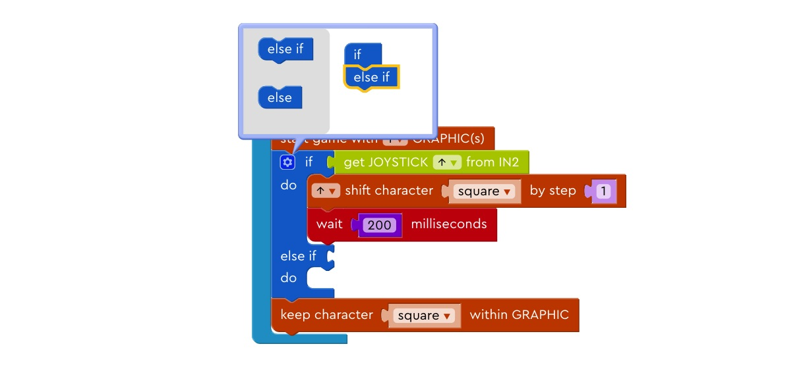
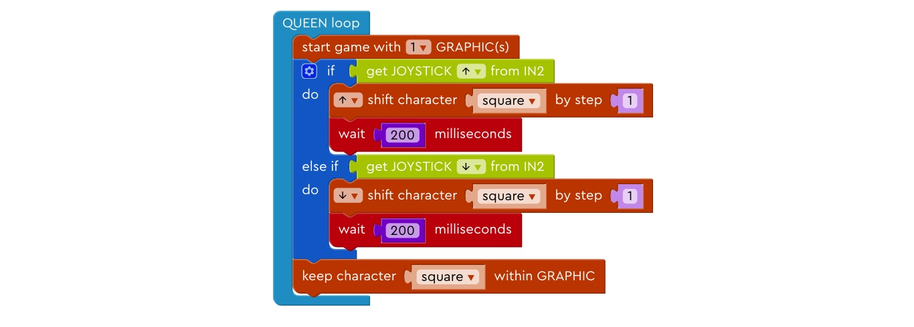
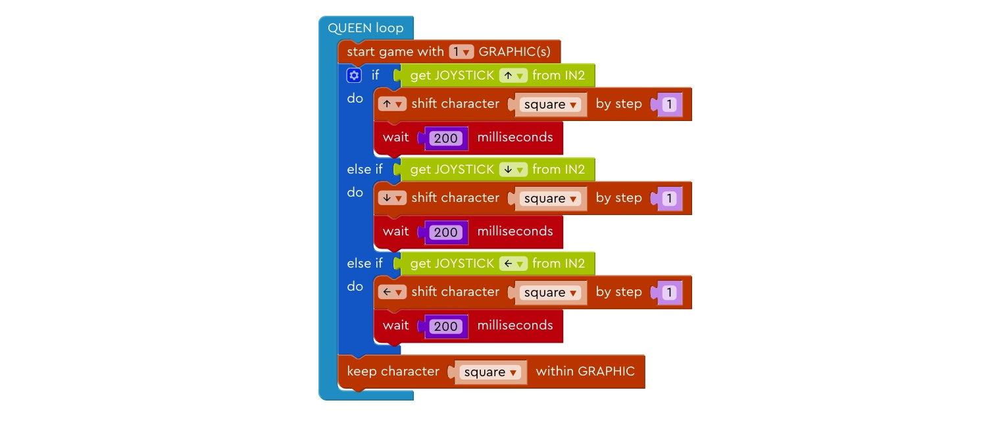
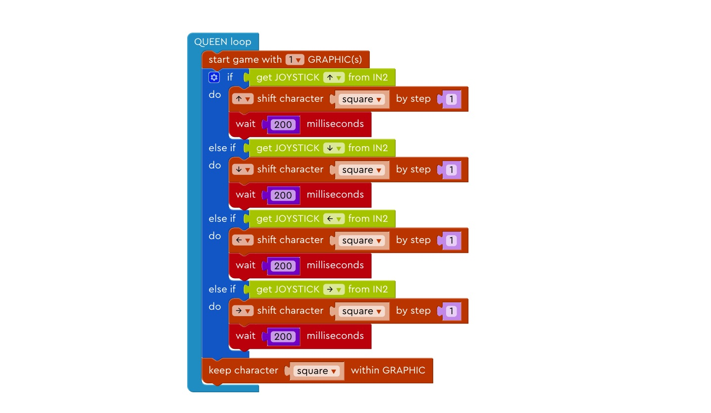
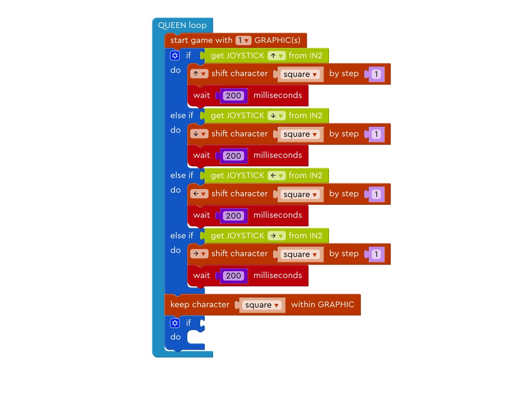
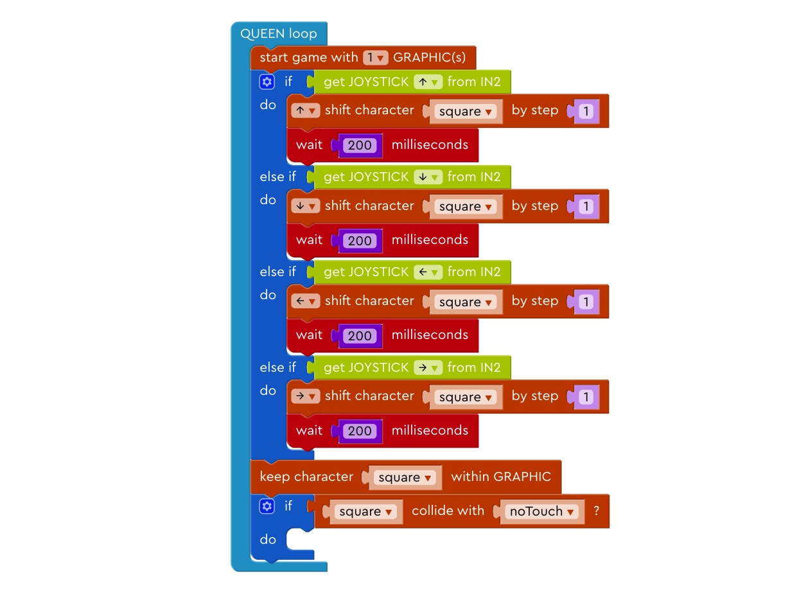
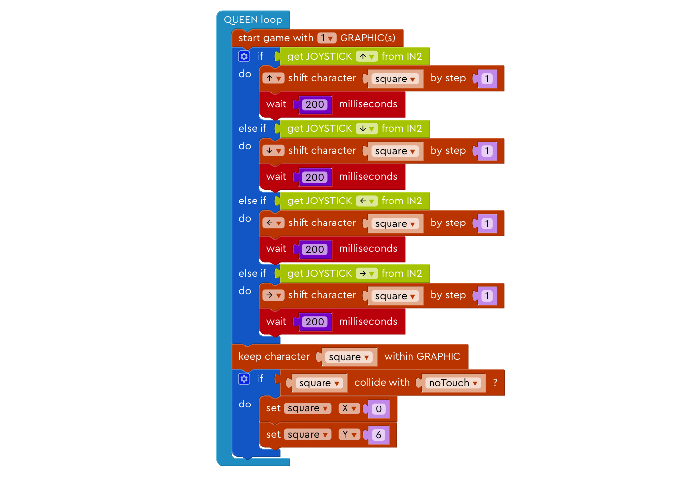
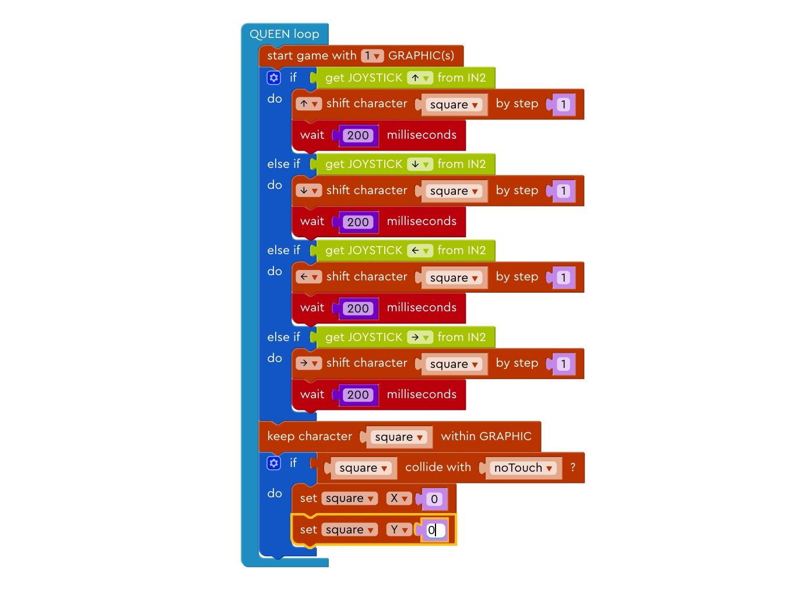
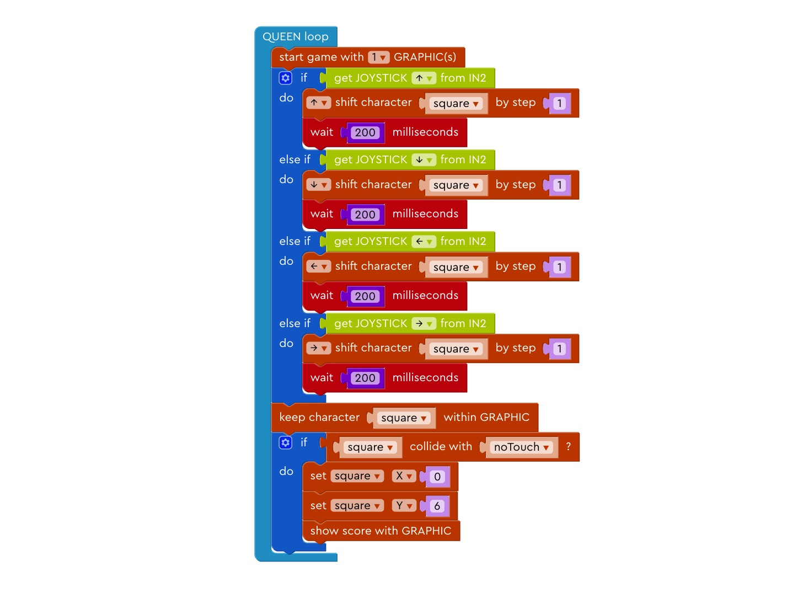
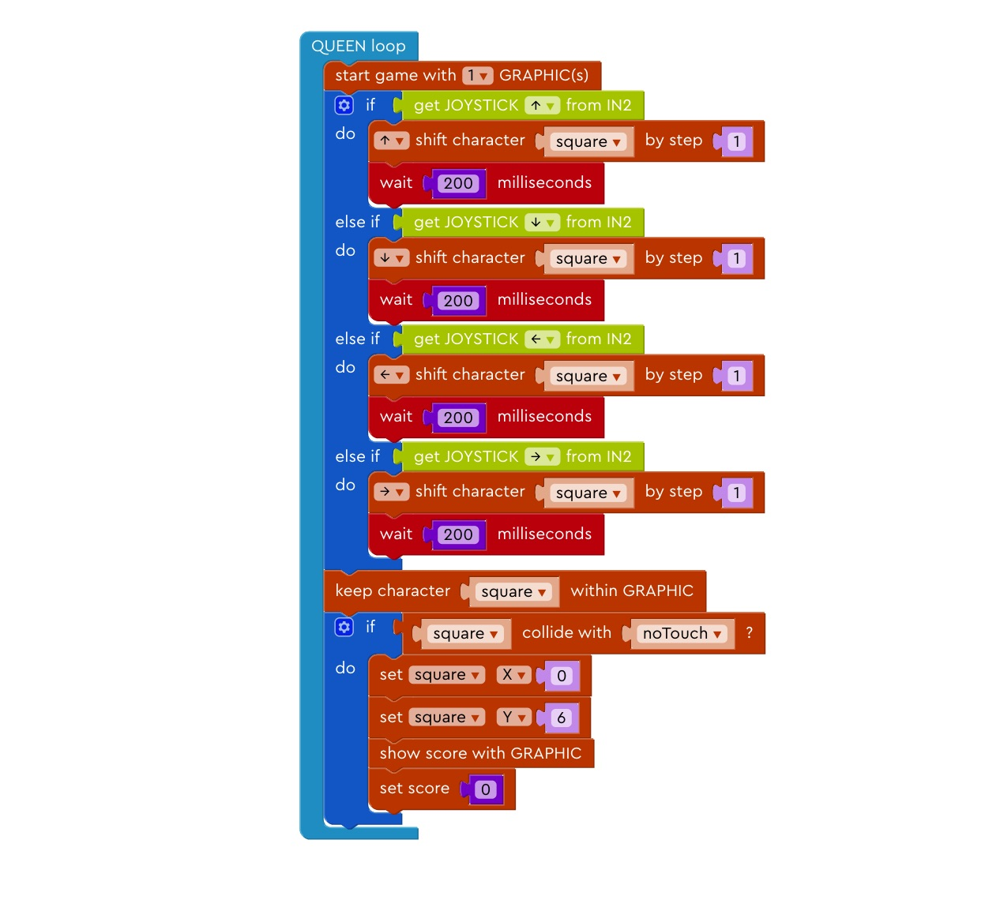

# Lesson

## Lesson 1

### Step 1: Basic Setup

Left for input, right for output.

### Step 2: Create a square

Draw a blue square at the bottom left corner, a shown in the demo.

### Step 3: Create a square

Try draw a yellow square at the same position.

### Step 4: Rename the character

Change the name from “character” to “square”.

### Step 5: Light up the LED board

Drag the block “start game with 1 GRAPHIC(s)”  into the QUEEN Loop.

### Step 6: Move Up 1

Drag “if-do” block under the “start game with 1 GRAPHIC” block.

### Step 7: Move Up 2

Drag the “Get JOYSTICK (direction) from IN2” block and put it after “if” block.

### Step 8: Move Up 3

Drag the “(direction) shift character x by step n” block and put it inside the “if-do” block.

### Step 9: Move Up 4

Drag the “wait n milliseconds” block and put it under the previous block and change the number to 200.

### Step 10: Keep the square inside LED board

Drag the “keep character within GRAPHIC” block and put it under the “if” block.

### Step 11: Move down 1

Create an “else if” branch under the current “if” block.

### Step 12: Move down 2

Drag the “get JOYSTICK (direction) from IN2”, put it after the “else-if” branch, and get the downward direction from the joystick.

### Step 13: Move down 3

In the else-if branch, make the square move one step down if and wait 200 milliseconds before moving on to the next block.

### Step 14: Move left

Repeat the process in previous steps to make the block move left when the joystick is shifted to the left.

### Step 15: Move right

Repeat the process in previous steps to make the block move right when the joystick is shifted to the right.

## Lesson 2

### Prelude

Now that we can control the movement of the character, let’s try to build a very simple game.

### Step 1: Create a center square

Draw a red square at the center of the LED board, as shown in the demo.

### Step 2: Rename the new square

Change the name of the newly created red square’s name to “noTouch”.

### Step 3: Another If condition

Put another “if-do” block at the bottom of the QUEEN loop.

### Step 4: Collision

Put the “(character) collide with (character)” block after the “if” block.

### Step 5: Reset the game 

Drag the blocks that set the position of the character into the “if” block.

### Step 6: Reset the game 2

Can you try to reset the blue block to the top left corner?

### Step 7: Count Scores 1

Drag “set score” block to Queen setup.

### Step 8: Count Scores 2

Change function name of the “do (function) per n milliseconds” to “countScores”.

### Step 9: Count Scores 3

Change the time of the “do countScores per n milliseconds” block to 1000

### Step 10: Counting Scores 4

Drag “change score by 1” block in the “countScores” function block.

### Step 11: Show Scores

Drag the “Show score with GRAPHIC” block and put it after we change the coordinates of the blue square.

### Step 12: Restart

Drag another “set score” block and put it after we show the score.

### Step 13: Counting Scores 1

Can you change one number so that the scores increases by 2 every 1000 milliseconds?

### Step 14: Counting Scores 2

Can you change one number so that the scores increases by 1 every 2 seconds? (1 second = 1000 millisecond)

