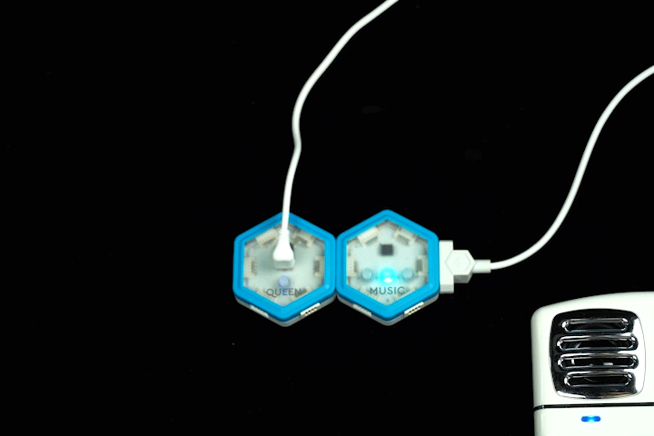

# Learning to Make Music Yourself!

Have you ever wanted to be a singer, DJ, or a music producer? Here's your beginners guide! We're here to help you get started on your music career with a twist of programing.

---

## Getting Started!

Before we get started on coding, it is important to make sure that we have everything connected.

### Step 1

Make sure you have downloaded our software and driver on your computer. If you haven't, you can download them here: 
<a href="http://microcn.org/" target="_blank">JUKU Download</a>

After you have successfully downloaded JUKU app on your computer, it's time to assemble the kit! 

### Step 2

Plug the USB cord into QUEEN module, and connect it to your computer.

### Step 3

Connect the MUSIC module to the **right** of the QUEEN module, as shown below.

 //TODO: change picture

### Step 4

Connect the AUX cord to an external speaker, as shown below.

 //TODO: change picture

**Now that we have assembled our kit, let's get to making some music!**

---

## Fun Code!

### Lesson 1. Play a song

#### Step 1: What instrument?

Music, broken down in the simplest way, are just combination of notes. We can play these notes on different instruments, but what matters is which instrument is the best for a specific song. Here, we choose the default, the **Electric Grand Piano**, to be the instrument we want to use.

#### Step 2: Choose a song!

You can choose what you want to play from a variety of sounds. Here, we want to play the **song** called **Twinkle Twinkle Little Star**, so we go to **"song"** group and choose **"Twinkle Twinkle Little Star"**.

#### Step 3: Play!

We have set up everything, now we want to tell it to play the song we choose. So we choose **play** on channel 1, which is the channel we told the music to play on.

### Lesson 2. Make a loop

#### Step 1: Do you remember what we just did?

Same with before, we want to play the song **Twinkle Twinkle Little Star**. So let's set it up just like we did in the last lesson!

#### Step 2: LOOP!

In the last lesson, did you notice that the song played once and stopped? If you want it to continue playing over and over again, just put the **play** block in the QUEEN loop. The QUEEN will tell MUSIC module to keep playing. 

### Lesson 3. Play & pause

#### Step 1: Switch it up

Now let's change the instrument and the song to make it more interesting! 

#### Step 2: Play N' Pause

In all music apps you use, you can play and pause at will. Let's make our kit do the same thing as well. Now, the clamps of the TOUCH module can sense if we are touch it or not, so we can make use of it. **If** we are touching a clamp, then the music plays, **else** the music stops. Have you seen the logic here? Now that we have the logic, putting it in blocks is just a matter of finding the right block and drag it to the right position!

### Lesson 4. Make a remix

#### Step 1: Again!

Let's do what we are most familiar with. Choose instrument and song, and set up channel 1.

#### Step 2: Remix It!

We can remix a piece of music by adding another piece of music on top of it, or a lot more pieces of music. However, we can't play the music on the same channel, because each channel can only play one piece of music, so we put differnt music on different channels.

#### Step 3: To Drum or Not To Drum

A drum really gives the music some beat, but perhaps we want it on and off based on our will. We can do this by repeating what we did in the last lesson. The only difference is that we are not pausing but stopping the music when stop touching the clamp. This is because whenever we want to start the drum, the drum should start with a full drum kick. If we pause the drum audio and stops a drum kick halfway, then when it resumes, the drum kick becomes incomplete.

