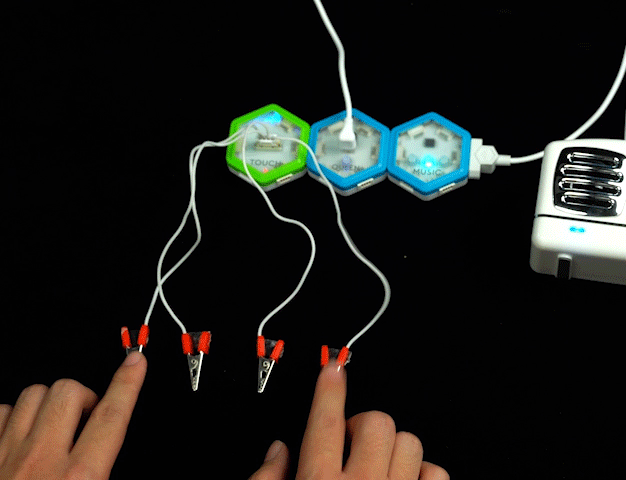
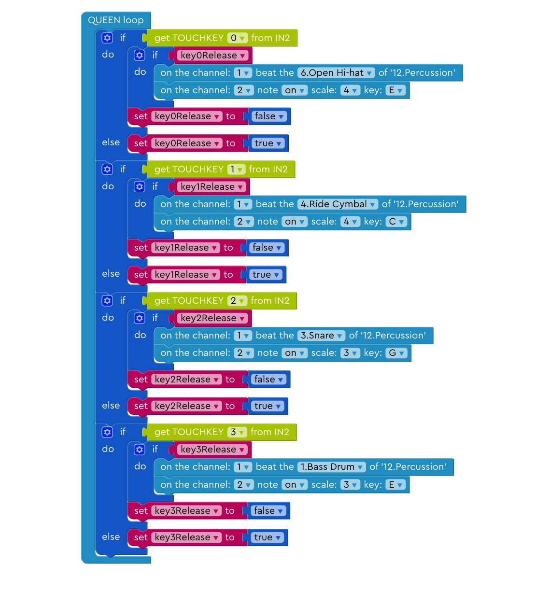
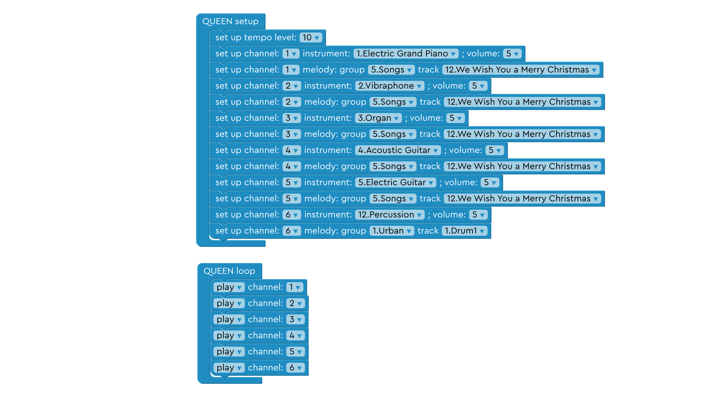
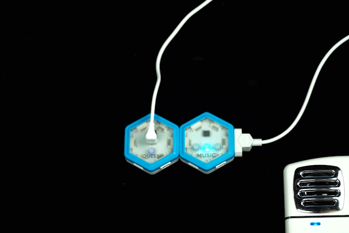
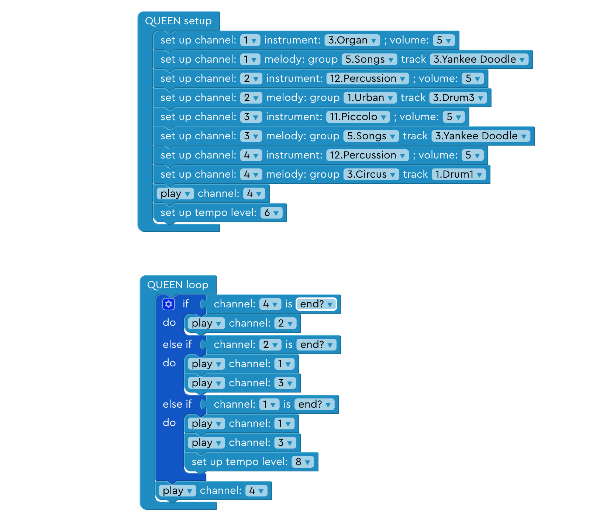
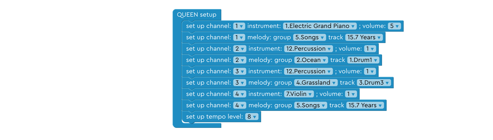
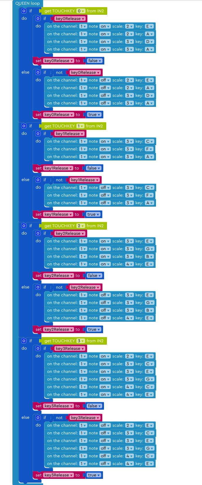

# More Music Effects For You!

We created some more music effects for you to learn and use! Find the effects you want to use and download them to your Music Kit!

- [Rhythm Master](#rhythm-master)

- [Acoustic Zone](#acoustic-zone)

- [Instrumental Ensemble](#instrumental-ensemble)

- [Remix](#remix)

- [London Bridge Remix / 7 Years Remix](#london-bridge-remix-/-7-years-remix)

- [Yankee Doodle Remix](#yankee-doodle-remix)

---

## Rhythm Master

(<a href="./sampleGames/rhythmMaster.xml" download>Click here to download</a>)

Lay the clamps connected to the TOUCH module on the table. Touch different clamps separately. You will hear different beats!

### Code Expert
---

#### 1. QUEEN Loop

This function checks if there are inputs from any of the four touch keys. Then it plays the sound that specific touch key is customized to play.

Click here to view source code

    void loop() {
        if (digital.getTouchKey() & (0x01 << 0)) {
            if (key0Release) {
                music.noteOn(0, 46, 127);
                music.noteOn(1, 64, 127);
            }
            key0Release = false;
        } else {
            key0Release = true;
        }
        if (digital.getTouchKey() & (0x01 << 1)) {
            if (key1Release) {
                music.noteOn(0, 59, 127);
                music.noteOn(1, 60, 127);
            }
            key1Release = false;
        } else {
            key1Release = true;
        }
        if (digital.getTouchKey() & (0x01 << 2)) {
            if (key2Release) {
                music.noteOn(0, 40, 127);
                music.noteOn(1, 55, 127);
            }
            key2Release = false;
        } else {
            key2Release = true;
        }
        if (digital.getTouchKey() & (0x01 << 3)) {
            if (key3Release) {
                music.noteOn(0, 35, 127);
                music.noteOn(1, 52, 127);
            }
            key3Release = false;
        } else {
            key3Release = true;
        }

    }

   

---
## Acoustic Zone

(<a href="./sampleGames/acousticZone.xml" download>Click here to download</a>)

Lay the clamps connected to the TOUCH module on the table. Touch different clamps separately. You will hear different harmony sounds!

### Code Expert
---

#### 1. QUEEN Loop

This function checks if there are inputs from any of the four touch keys. Then it plays the sound that specific touch key is customized to play. If the touch keys do not have inputs (i.e. nobody is touch the keys), then the music immediately stops playing.

 //TODO: change picture

Click here to view source code

    
    void loop() {
        if (digital.getTouchKey() & (0x01 << 0)) {
            if (key0Release) {
                music.noteOn(0, 41, 127);
                music.noteOn(0, 48, 127);
                music.noteOn(0, 53, 127);
                music.noteOn(0, 57, 127);
                music.noteOn(0, 60, 127);
                music.noteOn(0, 65, 127);
            }
            key0Release = false;
        } else {
            if (!key0Release) {
                music.noteOff(0, 41, 127);
                music.noteOff(0, 48, 127);
                music.noteOff(0, 53, 127);
                music.noteOff(0, 57, 127);
                music.noteOff(0, 60, 127);
                music.noteOff(0, 65, 127);
            }
            key0Release = true;
        }
        if (digital.getTouchKey() & (0x01 << 1)) {
            if (key1Release) {
                music.noteOn(0, 40, 127);
                music.noteOn(0, 47, 127);
                music.noteOn(0, 52, 127);
                music.noteOn(0, 55, 127);
                music.noteOn(0, 59, 127);
                music.noteOn(0, 64, 127);
            }
            key1Release = false;
        } else {
            if (!key1Release) {
                music.noteOff(0, 40, 127);
                music.noteOff(0, 47, 127);
                music.noteOff(0, 52, 127);
                music.noteOff(0, 55, 127);
                music.noteOff(0, 59, 127);
                music.noteOff(0, 64, 127);
            }
            key1Release = true;
        }
        if (digital.getTouchKey() & (0x01 << 2)) {
            if (key2Release) {
                music.noteOn(0, 40, 127);
                music.noteOn(0, 45, 127);
                music.noteOn(0, 50, 127);
                music.noteOn(0, 57, 127);
                music.noteOn(0, 62, 127);
                music.noteOn(0, 65, 127);
            }
            key2Release = false;
        } else {
            if (!key2Release) {
                music.noteOff(0, 40, 127);
                music.noteOff(0, 45, 127);
                music.noteOff(0, 50, 127);
                music.noteOff(0, 57, 127);
                music.noteOff(0, 62, 127);
                music.noteOff(0, 65, 127);
            }
            key2Release = true;
        }
        if (digital.getTouchKey() & (0x01 << 3)) {
            if (key3Release) {
                music.noteOn(0, 40, 127);
                music.noteOn(0, 48, 127);
                music.noteOn(0, 52, 127);
                music.noteOn(0, 55, 127);
                music.noteOn(0, 60, 127);
                music.noteOn(0, 64, 127);
            }
            key3Release = false;
        } else {
            if (!key3Release) {
                music.noteOff(0, 40, 127);
                music.noteOff(0, 48, 127);
                music.noteOff(0, 52, 127);
                music.noteOff(0, 55, 127);
                music.noteOff(0, 60, 127);
                music.noteOff(0, 64, 127);
            }
            key3Release = true;
        }
    
    }

   

---
## Instrumental Ensemble
(<a href="./sampleGames/instrumentalEnsemble.xml" download>Click here to download</a>)

Merry Christmas using multiple instruments all together!

### Code Expert
---

#### 1. QUEEN loop

This function sets up different channels to different instruments. Then it plays "We Wish You A Merry Christmas" on these different channels, resulting in different instruments playing this song at the same time.

Click here to view source code

    void setup() {
        startupMelody();
        HCPortInit();
        music.enterRtMidi();
        for (uint8_t ch = 0; ch < 16; ch++) { music.allNoteOff(ch); }
        delay(100);

        hc_music_play_tempo = 40;
        music.setupMidi(0, 0x79, 2, 127);
        music.setupMidi(1, 0x79, 11, 127);
        music.setupMidi(2, 0x79, 19, 127);
        music.setupMidi(3, 0x79, 24, 127);
        music.setupMidi(4, 0x79, 29, 127);
        music.setupMidi(5, 0x78, 37, 127);

    }

    void loop() {
        player_0.run(hc_music_play_tempo);
        player_1.run(hc_music_play_tempo);
        player_2.run(hc_music_play_tempo);
        player_3.run(hc_music_play_tempo);
        player_4.run(hc_music_play_tempo);
        player_5.run(hc_music_play_tempo);
        player_0.playback();
        player_1.playback();
        player_2.playback();
        player_3.playback();
        player_4.playback();
        player_5.playback();

    }

   

## Remix

(<a href="./sampleGames/remix.xml" download>Click here to download</a>)

Remixing the famous song "Yankee Doodle".

### Code Expert
---

#### 1. QUEEN Loop

This function starts with playing a piece of introductory drum. After this piece is completed, it plays a second piece of introductory piece with two intruments. After the second piece completes, it moves on to playing melody accompanied by the second piece.

Click here to view source code

    void setup() {
        startupMelody();
        HCPortInit();
        music.enterRtMidi();
        for (uint8_t ch = 0; ch < 16; ch++) { music.allNoteOff(ch); }
        delay(100);
    
        music.setupMidi(0, 0x79, 19, 127);
        music.setupMidi(1, 0x78, 37, 127);
        music.setupMidi(2, 0x79, 72, 127);
        music.setupMidi(3, 0x78, 37, 127);
        player_3.playback();
        hc_music_play_tempo = 80;
    
    }
    
    void loop() {
        player_0.run(hc_music_play_tempo);
        player_1.run(hc_music_play_tempo);
        player_2.run(hc_music_play_tempo);
        player_3.run(hc_music_play_tempo);
        if (player_3.isEnd()) {
            player_1.playback();
        } else if (player_1.isEnd()) {
            player_0.playback();
            player_2.playback();
        } else if (player_0.isEnd()) {
            player_0.playback();
            player_2.playback();
            hc_music_play_tempo = 60;
        }
        player_3.playback();
    
    }

   

---

## London Bridge Remix / 7 Years Remix

**London Bridge Remix**: <a href="./sampleGames/londonBridgeRemix.xml" download>Click here to download </a>

**7 Years Remix**: <a href="./sampleGames/7YearsRemix.xml" download>Click here to download</a>

Remixing the famous song "London Bridge is Falling down" / "7 Years".

> TODO: Add pic/gif here

### Code Expert
---

#### 1. QUEEN setup

London Bridge Remix:

7 Years Remix:

This function sets different channels to different default instruments, songs, and tempo level.

London Bridge Remix:

Click here to view source code

    void setup() {
        startupMelody();
        HCPortInit();
        music.enterRtMidi();
        for (uint8_t ch = 0; ch < 16; ch++) { music.allNoteOff(ch); }
        delay(100);

        music.setupMidi(0, 0x79, 29, 127);
        music.setupMidi(1, 0x78, 37, 76);
        music.setupMidi(2, 0x78, 37, 93);
        hc_music_play_tempo = 70;

    }

   

7 Years Remix:

Click here to view source code

    void setup() {
        startupMelody();
        HCPortInit();
        music.enterRtMidi();
        for (uint8_t ch = 0; ch < 16; ch++) { music.allNoteOff(ch); }
        delay(100);
    
        music.setupMidi(0, 0x79, 2, 127);
        music.setupMidi(1, 0x78, 37, 59);
        music.setupMidi(2, 0x78, 37, 59);
        music.setupMidi(3, 0x79, 40, 59);
        hc_music_play_tempo = 60;
    
    }

   

#### 2. QUEEN loop

London Bridge Remix:

7 Years Remix:

This function repetitively plays channels at the same time.

London Bridge Remix:

Click here to view source code

    void loop() {
        player_0.run(hc_music_play_tempo);
        player_1.run(hc_music_play_tempo);
        player_2.run(hc_music_play_tempo);
        player_0.playback();
        player_1.playback();
        player_2.playback();

    }

   

7 Years Remix:

Click here to view source code

    void loop() {
        player_0.run(hc_music_play_tempo);
        player_1.run(hc_music_play_tempo);
        player_2.run(hc_music_play_tempo);
        player_3.run(hc_music_play_tempo);
        player_0.playback();
        player_1.playback();
        player_2.playback();
        player_3.playback();

    }

   

---

## Yankee Doodle Remix

(<a href="./sampleGames/yankeeDoodleTouchKey.xml" download>Click here to download</a>)

This program plays the remixed version of "Yankee Doodle" in the background, and you can  use the touch keys to add beats to it.

> TODO: Add pic/gif here

### Code Expert
---

#### 1. QUEEN setup

This function sets different channels to different default instruments, songs, and tempo level.

Click here to view source code

    void setup() {
        startupMelody();
        HCPortInit();
        music.enterRtMidi();
        for (uint8_t ch = 0; ch < 16; ch++) { music.allNoteOff(ch); }
        delay(100);
        digital.init();
        playTimer.every(0, play);

        music.setupMidi(0, 0x78, 37, 127);
        music.setupMidi(1, 0x79, 19, 127);
        music.setupMidi(2, 0x78, 37, 127);
        music.setupMidi(3, 0x79, 72, 127);
        music.setupMidi(4, 0x78, 37, 127);
        hc_music_play_tempo = 80;
        player_4.playback();

    }

   

#### 2. QUEEN loop

This function reads input from the TOUCH block. It plays different sounds depending on which key is touched.

Click here to view source code

    void loop() {
        player_1.run(hc_music_play_tempo);
        player_2.run(hc_music_play_tempo);
        player_3.run(hc_music_play_tempo);
        player_4.run(hc_music_play_tempo);
        if (digital.getTouchKey() & (0x01 << 0)) {
            if (key0Release) {
                music.noteOn(0, 40, 127);
                music.noteOn(0, 45, 127);
                music.noteOn(0, 50, 127);
                music.noteOn(0, 57, 127);
            }
            key0Release = false;
        } else {
            if (!key0Release) {
                music.noteOff(0, 40, 127);
                music.noteOff(0, 45, 127);
                music.noteOff(0, 50, 127);
                music.noteOff(0, 57, 127);
            }
            key0Release = true;
        }
        if (digital.getTouchKey() & (0x01 << 1)) {
            if (key1Release) {
                music.noteOn(0, 48, 127);
                music.noteOn(0, 53, 127);
                music.noteOn(0, 57, 127);
            }
            key1Release = false;
        } else {
            if (!key1Release) {
                music.noteOff(0, 48, 127);
                music.noteOff(0, 53, 127);
                music.noteOff(0, 57, 127);
            }
            key1Release = true;
        }
        if (digital.getTouchKey() & (0x01 << 2)) {
            if (key2Release) {
                music.noteOn(0, 52, 127);
                music.noteOn(0, 55, 127);
                music.noteOn(0, 59, 127);
                music.noteOn(0, 64, 127);
            }
            key2Release = false;
        } else {
            if (!key2Release) {
                music.noteOff(0, 52, 127);
                music.noteOff(0, 55, 127);
                music.noteOff(0, 59, 127);
                music.noteOff(0, 64, 127);
            }
            key2Release = true;
        }
        if (digital.getTouchKey() & (0x01 << 3)) {
            if (key3Release) {
                music.noteOn(0, 40, 127);
                music.noteOn(0, 48, 127);
                music.noteOn(0, 52, 127);
                music.noteOn(0, 55, 127);
                music.noteOn(0, 60, 127);
                music.noteOn(0, 64, 127);
            }
            key3Release = false;
        } else {
            if (!key3Release) {
                music.noteOff(0, 40, 127);
                music.noteOff(0, 48, 127);
                music.noteOff(0, 52, 127);
                music.noteOff(0, 55, 127);
                music.noteOff(0, 60, 127);
                music.noteOff(0, 64, 127);
            }
            key3Release = true;
        }
        playTimer.update();

    }

   

#### 3. play

This funciton is the same with QUEEN loop of the previous program **Remix**. [See here](#id6).

Click here to view source code

    void play() {
        if (player_4.isEnd()) {
            player_2.playback();
        } else if (player_2.isEnd()) {
            player_1.playback();
            player_3.playback();
        } else if (player_1.isEnd()) {
            player_1.playback();
            player_3.playback();
            hc_music_play_tempo = 70;
        }
        player_4.playback();
    }

   
