# Lesson

## Lesson 1

### Step 1: Basic Setup

Left for input, right for output.

### Step 2: QUEEN Setup

QUEEN Setup runs once after the program starts.

### Step 3: Play A Song Once

Drag the block into the correct position to play the song once.

### Step 4: QUEEN Loop

QUEEN Loop runs over and over again after the program starts.

### Step 5: Play A Song Over and Over Again

Drag the block into the correct position to play the song over and over again until you stop the program.

### Step 6: Play A Song You Like

Which song do you like? Find the song you like and play it once.

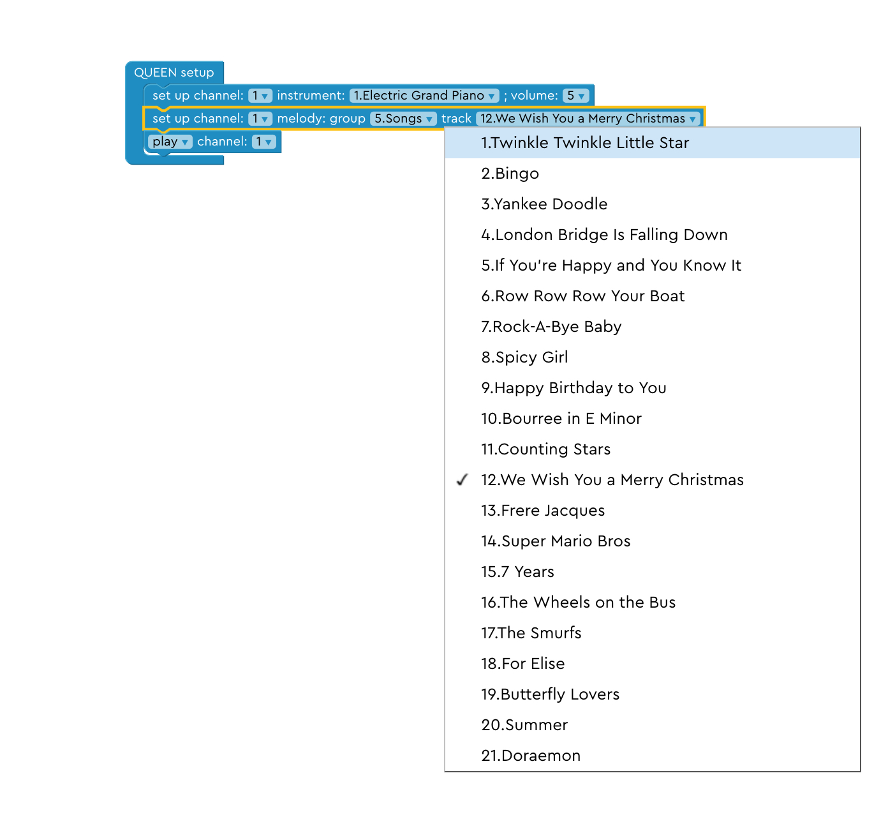

### Step 7: Play Two Songs

Arrange the blocks in the correct order to play song1 first and play song2 second. 

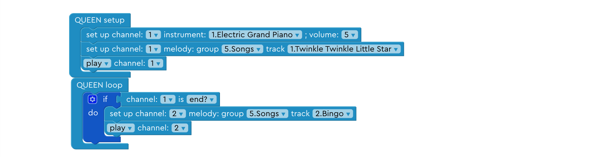

### Step 8: Play Song A and Song B

Find the blocks you need in the left, then choose Song A and Song B. Arrange the blocks in the correct order to play song A first and play song B second. 

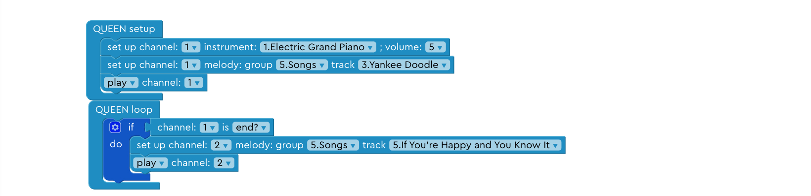

### Step 9: Delete the Last Block

Delete the last block so that we only play the first two songs.

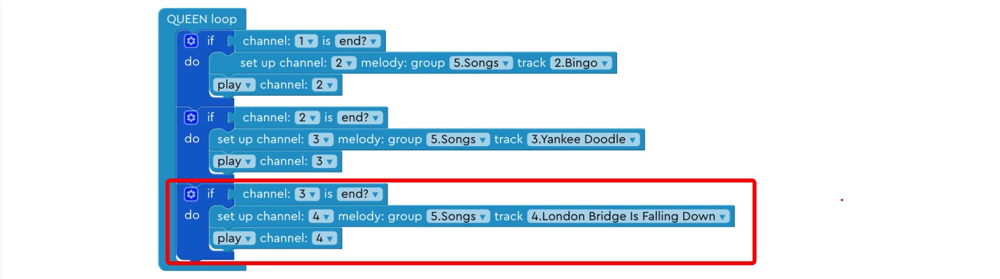

### Step 10: Delete the Middle Block

Delete the last block so that we only play the first two songs.

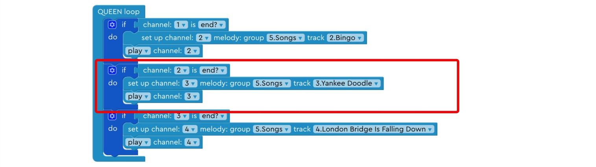

### Step 11: Choose an instrument

Choose another instrument to switch up the vibe!

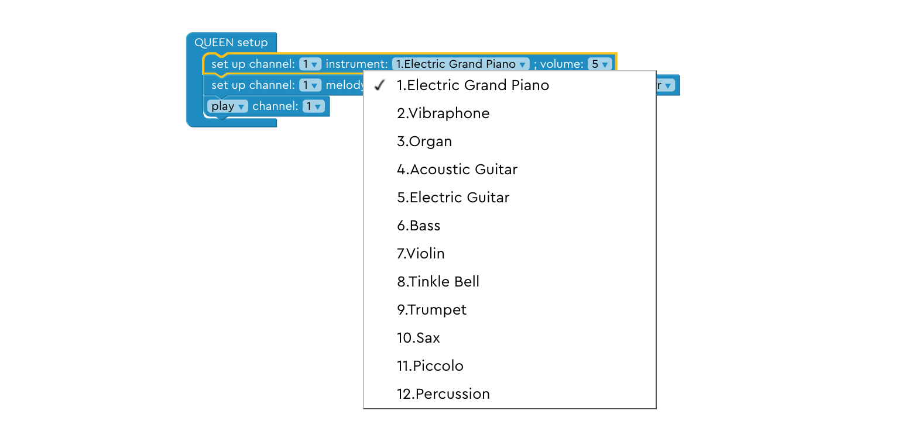

### Step 12: Choose another instrument

Choose an instrument you like!

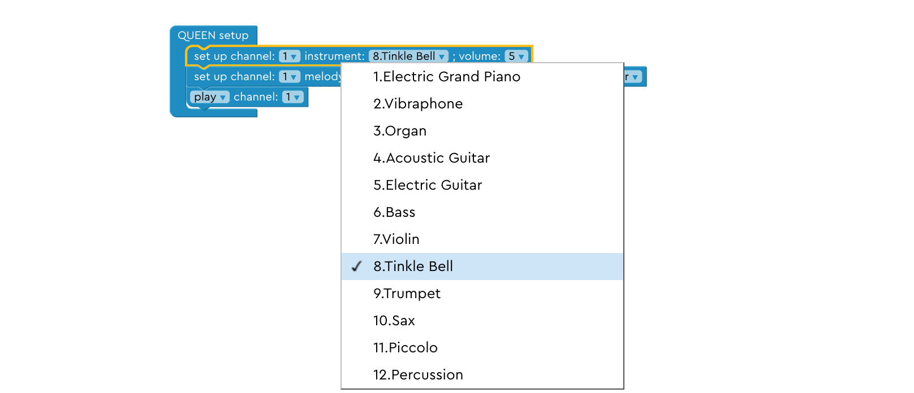

### Step 13: Use two channels

Use two channels to play a song with two different instruments at the same time.

### Step 14: Play song A and beat B together.

Change the second instrument to a percussion instrument.

## Lesson 2

### Step 1: Assemble input module

Connect the TOUCH block.

### Step 2: If statement

Press “upload” and touch one of the keys to see what happens!

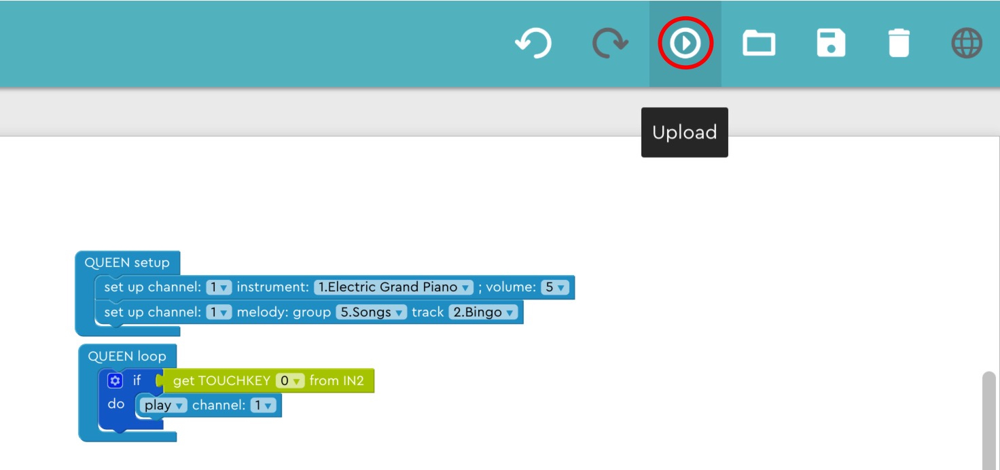

### Step 3: Change input key

Use another key to play the music!

### Step 4: Add another else branch

Add an “else-if” branch under the current if-else statement.

### Step 5: Set up the second input key 1

Add “get TOUCHKEY” block into the else-if branch.

### Step 6: Set up the second input key 2

Change “get TOUCHKEY” to get input from the second touch key.

### Step 7: Add a channel

Add a second channel for the newly added touch key.

### Step 8: Set up the second input key to beat

Play beat in the second channel.

### Step 9: Play the beat 5 time 1

Drag “repeat n times” block to the else-if branch.

### Step 10: Play the beat 5 time 2

Change the number in the “repeat” block to 5 and add “play channel 2” into the repeat block.

### Step 11: Set up the third key 1

Try set up a third key! You need to create another else-if branch, get the third touch key input.

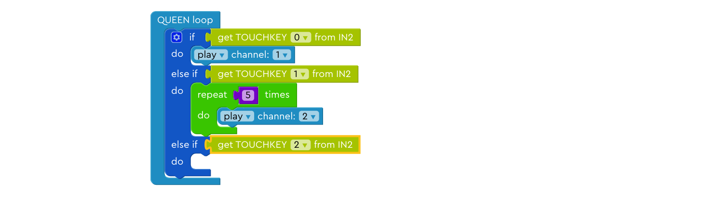

### Step 12: Set up the third key 2

Set up the third channel, play song B with instrument B on this channel.

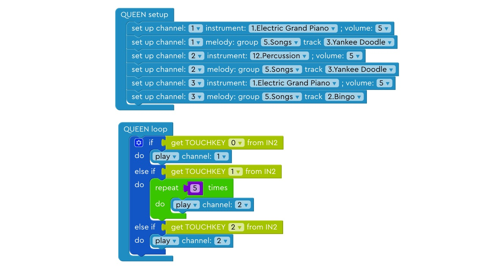

### Step 13: Set up the fourth key

Try set up a fourth key on your own! You need to create another else-if branch, get the fourth touch key input. Set up the fourth channel, play song C with instrument C on this channel.

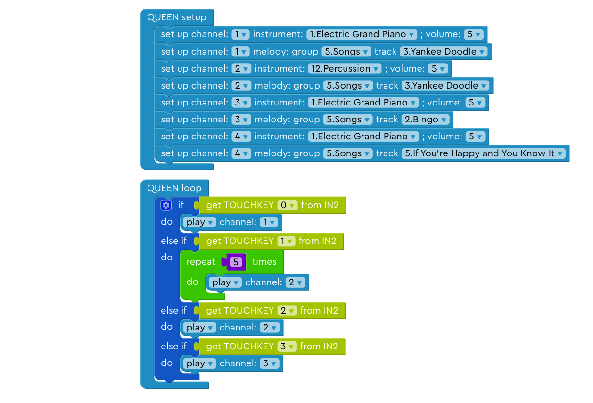

